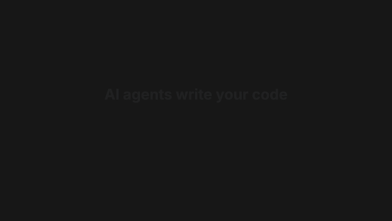

<p align="center">
  <a href="https://pablomanjarres.com/oss/nella"></a>
</p>

<h1 align="center">Nella</h1>

<p align="center"><em>Codebase intelligence for AI coding agents: AST-indexed hybrid search, persistent context, and typed assumptions that invalidate themselves when the code moves.</em></p>

<p align="center">
  
  
  
  <a href="https://www.npmjs.com/package/@getnella/mcp"></a>
  
  
  <a href="https://pablomanjarres.com/oss/nella"></a>
  <a href="https://pablomanjarres.com/portfolio/projects/nella"></a>
</p>

Nella sits between an AI coding agent and your repository. It indexes the real code into AST-aware chunks, serves hybrid semantic and lexical search that reports how confident it is, and keeps a running memory of the assumptions, changes, and dependencies the agent is working against. Coding agents hallucinate imports and symbols that were never there, forget decisions they made three turns ago, and edit against schemas that already moved. Nella grounds them in what the codebase actually contains, and flags the assumptions a file change just invalidated.

It ships as three surfaces over one engine: an MCP server a coding agent calls, a `nella` CLI for the terminal, and a REST plus WebSocket API. Live at [getnella.dev](https://getnella.dev).

## See it in action

<p align="center"></p>

## Highlights

- **AST-aware chunking.** `chunker.ts` parses TypeScript and JavaScript with `@typescript-eslint/typescript-estree` and cuts chunks on real function, class, and interface boundaries (a 512-token target, a 100-token floor, 50-token overlap), then falls back to recursive splitting for other languages. Each chunk carries the symbols it defines, so a hit is a whole unit of code rather than an arbitrary window of lines.
- **Hybrid search with a confidence score.** `hybrid-search.ts` fuses vector results (HNSW over `usearch`) and BM25 results (a Porter-stemmed lexical index) with Reciprocal Rank Fusion (k=60, weighted 0.4 semantic and 0.6 lexical), optionally reranks the top hits through Voyage (Cohere on the Azure fallback), and returns a `confidence` value plus a `suggestion` (`use_results`, `low_confidence`, `query_unclear`, or `no_matches`) so the agent knows whether to trust the results.
- **Typed assumptions that invalidate themselves.** `assumption-tracker.ts` records an assumption with a type (`schema`, `interface`, `dependency`, `behavior`, `config`, or `structure`) and the files it depends on as glob patterns. Every run, `checkInvalidations()` walks the modified files and flips any assumption whose files moved to invalid, so a stale schema assumption surfaces before the next edit is written against it.
- **Change ledger and dependency drift.** `change-ledger.ts` records every create, modify, and delete with a reason, a content hash, and `dependsOn` links for impact analysis. `dependency-tracker.ts` SHA-256-hashes `package.json` and the lockfile (npm, pnpm, or yarn) between runs and reports which dependencies were added, removed, or version-bumped since the agent last looked.
- **Prompt-injection scorer.** `injection-scorer.ts` runs a weighted multi-factor model at index time (scanner pattern matches, natural-language density inside code, imperative-verb density, and more), scores each chunk from 0.0 to 1.0, stores it on the content source, and lets the search layer flag suspicious hits inline. A challenge-response heartbeat then verifies trust-chain continuity between tool calls: if an injection hijacks the agent, the next `nella` call fails the challenge.

## How it works

```text
nella/
├── packages/
│   ├── core/            # @usenella/core: the engine, consumed as a library
│   │   └── src/
│   │       ├── indexing/    # AST chunker · BM25 lexical · HNSW vectors · hybrid
│   │       │                #   search · code verifier · dependency graph · injection scorer
│   │       ├── context/     # session store · assumption tracker · change ledger · deps
│   │       ├── workspace/   # register and switch between workspaces
│   │       ├── auth/        # encrypted API-key storage + JWT sessions
│   │       ├── rate-limit/  # in-memory or Redis throttling
│   │       └── sync/ · gcp/ · supabase/   # optional cloud-sync tiers
│   ├── nella/           # @getnella/mcp: the CLI and the MCP server
│   ├── api/             # @usenella/api: REST + WebSocket service over core
│   └── benchmark/       # @usenella/benchmark: capability + safety eval harness
```

The engine lives in `@usenella/core`. Three surfaces sit on top of it: the **MCP server** (`@getnella/mcp`, stdio by default or HTTP via `nella serve`) that a coding agent calls, the **`nella` CLI** for indexing and searching from a terminal, and the **REST plus WebSocket API** (`@usenella/api`). Core is agent-agnostic: the agent calls Nella over one of these surfaces, never the other way around.

## Terminal usage

Nella is a CLI, an MCP server, and an embeddable library, so there is no app to screenshot. It runs in your terminal and inside your coding agent.

```bash
# install the CLI + MCP server globally
npm install -g @getnella/mcp

# index a repository: AST chunks + BM25 + vectors
nella index --workspace /path/to/project --force

# search it from the terminal, with a confidence score
nella search "where is auth verified" --detail full --top-k 10

# wire Nella into your coding agent over MCP
nella connect --client claude-code
nella connect --client cursor
nella connect --client vscode
# ...windsurf and cline are supported too; omit --client to configure every detected agent

# one-liner for Claude Code (alias for: connect --client claude-code --mode local)
nella setup

# or run the stdio MCP server directly, no global install
npx -y @getnella/mcp --workspace /path/to/project
```

The MCP surface exposes 18 tools: `nella_index`, `nella_search`, `nella_get_context`, `nella_add_assumption`, `nella_check_assumptions`, `nella_check_dependencies`, `nella_branch_info`, and `nella_heartbeat`, plus a ten-tool multi-agent set (`nella_agent_register`, `nella_agent_claim_task`, `nella_agent_record_decision`, `nella_agent_check_conflicts`, and the rest) for coordinating several agents against one codebase.

## What's inside

| Package | What it is | Published |
|---|---|---|
| `@usenella/core` · `packages/core` | The engine: AST indexing, hybrid search, code verifier, dependency graph, context trackers (assumptions, change ledger, dependency drift), auth, rate limiting, and optional cloud sync. Embed it as a library. | internal |
| `@getnella/mcp` · `packages/nella` | The `nella` CLI and the MCP server: index a repo, run hybrid search, and wire Nella into Claude Code, Cursor, VS Code, Windsurf, or Cline over stdio or HTTP. | [](https://www.npmjs.com/package/@getnella/mcp) |
| `@usenella/api` · `packages/api` | REST plus WebSocket service (Express) exposing workspace, search, context, auth, and GitHub endpoints, with a BullMQ job queue and Redis. | internal |
| `@usenella/benchmark` · `packages/benchmark` | Capability and safety eval harness: runs coding agents (Claude, GPT) against tasks and scores pass rate, constraint violations, scope creep, refusal correctness, and a prompt-injection layer suite. | internal |

## Getting started

Requires Node 18 or newer and pnpm.

```bash
git clone https://github.com/nella-labs/nella.git
cd nella

pnpm install
pnpm build        # build every package
pnpm test         # run the test suites

pnpm dev:api      # run the REST + WebSocket API locally
pnpm benchmark    # run the eval harness
```

### Configuration

Copy `.env.example` to `.env` and set only the values you need. Nothing is hardcoded; everything is read from the environment.

```bash
cp .env.example .env
```

**Embeddings and reranking run on Voyage AI**, reached through the MongoDB Atlas endpoint, not Vertex:

```bash
VOYAGE_API_KEY=...
VOYAGE_ENDPOINT=https://ai.mongodb.com/v1
```

**Cloud sync is optional.** The `gcp` tier uses Cloud Storage for index artifacts and Cloud SQL for metadata, authenticated with Application Default Credentials (ADC), the standard Google Cloud pattern. Point at a service-account key file, or use ambient ADC (running on GCP, or after `gcloud auth application-default login`):

```bash
# auth, pick ONE:
export GOOGLE_APPLICATION_CREDENTIALS=/path/to/service-account.json   # explicit key file
# ...or rely on ambient ADC on GCP / after `gcloud auth application-default login`

# project + resources (read from env, never hardcoded):
export GCP_PROJECT_ID=your-project           # GOOGLE_CLOUD_PROJECT is also honored
export GCP_STORAGE_BUCKET=your-index-bucket
export GCP_CLOUD_SQL_INSTANCE=project:region:instance
export GCP_DB_USER=... GCP_DB_PASSWORD=... GCP_DB_NAME=nella
```

A Supabase sync tier and Redis-backed rate limiting are configured the same way. See `.env.example` for every option.

## License

MIT. See [LICENSE](./LICENSE).

---

<p align="center">
  <a href="https://pablomanjarres.com/oss/nella">Landing</a> ·
  <a href="https://pablomanjarres.com/portfolio/projects/nella">Portfolio write-up</a> ·
  Built by Pablo Manjarres
</p>
