# Nella Architecture

> Reliability layer for AI coding agents - v0.0.0

---

## 1. System Overview

```mermaid
graph TB
    Agent["AI Coding Agent<br/>(Claude, Copilot, Cursor, Cline)"]

    subgraph nella_pkg["@usenella/nella v0.2.2"]
        CLI["CLI<br/>nella check | validate | run | mcp | serve | connect | auth | playground"]
        MCP["MCP Server<br/>(stdio transport)"]
        HostedMCP["Hosted MCP Server<br/>(Streamable HTTP)"]
        AuthCLI["Auth CLI<br/>login | logout | status"]
    end

    subgraph core_pkg["@usenella/core v0.0.0"]
        RunEngine["Run Engine<br/>runTask() | check() | validate()"]
        Validators["Validators"]
        Safety["Safety"]
        Indexing["Indexing / RAG"]
        Context["Context Management"]
        Workspace["Workspace Management"]
        Auth["Auth & Rate Limiting"]
        Sync["Cloud Sync"]
        ContextSharing["Context Sharing"]
        Playground["Playground Server"]
        Export["Export Manager"]
        Agents["Agent Runner"]
        RateLimit["Rate Limiting"]
        GCP["GCP Backend"]
        Supabase["Supabase Backend"]
    end

    subgraph benchmark_pkg["@usenella/benchmark v0.1.0"]
        BenchRunner["Benchmark Runner"]
        Adapters["Agent Adapters<br/>(Anthropic, OpenAI)"]
        Metrics["Metrics Calculator"]
        Reports["Report Generators"]
    end

    subgraph external["External Services"]
        Supabase["Supabase<br/>(PostgreSQL + pgvector)"]
        GCP["Google Cloud<br/>(Cloud SQL + Storage)"]
        EmbeddingAPIs["Embedding APIs<br/>(Voyage, OpenAI)"]
        Cohere["Cohere<br/>(Reranking)"]
        LLMAPIs["LLM APIs<br/>(Anthropic, OpenAI)"]
    end

    Agent -->|"stdio (MCP protocol)"| MCP
    Agent -->|"direct"| CLI
    MCP --> RunEngine
    CLI --> RunEngine
    RunEngine --> Validators
    RunEngine --> Safety
    RunEngine --> Context
    Indexing --> EmbeddingAPIs
    Indexing --> Cohere
    Sync --> Supabase
    Sync --> GCP
    BenchRunner --> Adapters
    Adapters --> LLMAPIs

    style Agent fill:#6366f1,color:#fff
    style nella_pkg fill:#f3e8ff,stroke:#7c3aed
    style core_pkg fill:#ede9fe,stroke:#6d28d9
    style benchmark_pkg fill:#fef3c7,stroke:#d97706
    style external fill:#ecfdf5,stroke:#059669
```

---

## 2. Monorepo Structure

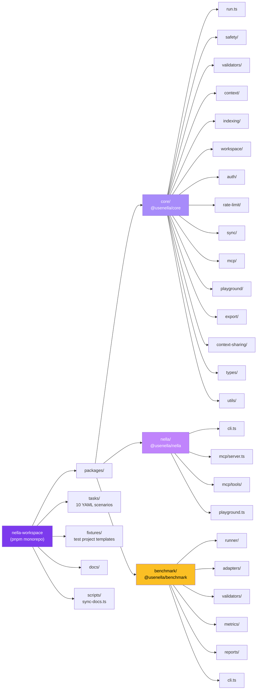
```mermaid
graph LR
    Root["nella-workspace<br/>(pnpm monorepo)"]

    Root --> Packages["packages/"]
    Root --> Tasks["tasks/<br/>10 YAML scenarios"]
    Root --> Fixtures["fixtures/<br/>test project templates"]
    Root --> Docs["docs/"]
    Root --> Scripts["scripts/<br/>sync-docs.ts"]

    Packages --> Core["core/<br/>@usenella/core"]
    Packages --> Nella["nella/<br/>@usenella/nella"]
    Packages --> Benchmark["benchmark/<br/>@usenella/benchmark"]

    Core --> C_Run["run.ts"]
    Core --> C_Safety["safety/"]
    Core --> C_Validators["validators/"]
    Core --> C_Context["context/"]
    Core --> C_Indexing["indexing/"]
    Core --> C_Workspace["workspace/"]
    Core --> C_Auth["auth/"]
    Core --> C_RateLimit["rate-limit/"]
    Core --> C_Sync["sync/"]
    Core --> C_MCP["mcp/"]
    Core --> C_Playground["playground/"]
    Core --> C_Export["export/"]
    Core --> C_CtxShare["context-sharing/"]
    Core --> C_Types["types/"]
    Core --> C_Utils["utils/"]

    Nella --> N_CLI["cli.ts"]
    Nella --> N_MCP["mcp/server.ts"]
    Nella --> N_Tools["mcp/tools/"]
    Nella --> N_Play["playground.ts"]

    Benchmark --> B_Runner["runner/"]
    Benchmark --> B_Adapters["adapters/"]
    Benchmark --> B_Validators["validators/"]
    Benchmark --> B_Metrics["metrics/"]
    Benchmark --> B_Reports["reports/"]
    Benchmark --> B_CLI["cli.ts"]

    style Root fill:#7c3aed,color:#fff
    style Core fill:#a78bfa,color:#fff
    style Nella fill:#c084fc,color:#fff
    style Benchmark fill:#fbbf24,color:#000
```

---

## 3. Package Dependencies

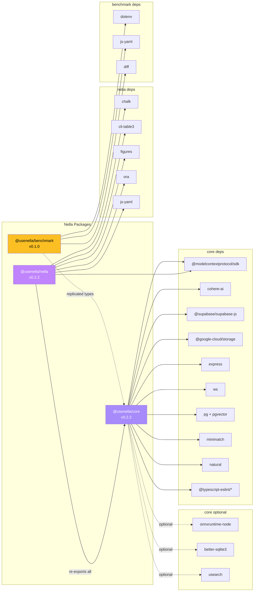
```mermaid
graph LR
    subgraph packages["Nella Packages"]
        nella["@usenella/nella<br/>v0.2.2"]
        core["@usenella/core<br/>v0.2.2"]
        bench["@usenella/benchmark<br/>v0.1.0"]
    end

    subgraph nella_deps["nella deps"]
        chalk["chalk"]
        cli_table["cli-table3"]
        figures["figures"]
        ora["ora"]
        jsyaml1["js-yaml"]
    end

    subgraph core_deps["core deps"]
        mcp_sdk["@modelcontextprotocol/sdk"]
        cohere["cohere-ai"]
        supabase_js["@supabase/supabase-js"]
        gcs["@google-cloud/storage"]
        express["express"]
        ws_lib["ws"]
        pg["pg + pgvector"]
        minimatch["minimatch"]
        natural["natural"]
        ts_eslint["@typescript-eslint/*"]
    end

    subgraph core_optional["core optional"]
        onnx["onnxruntime-node"]
        sqlite["better-sqlite3"]
        usearch["usearch"]
    end

    subgraph bench_deps["benchmark deps"]
        dotenv["dotenv"]
        jsyaml2["js-yaml"]
        diff_lib["diff"]
    end

    nella -->|"re-exports all"| core
    nella --> mcp_sdk
    nella --> chalk
    nella --> cli_table
    nella --> figures
    nella --> ora
    nella --> jsyaml1

    core --> mcp_sdk
    core --> cohere
    core --> supabase_js
    core --> gcs
    core --> express
    core --> ws_lib
    core --> pg
    core --> minimatch
    core --> natural
    core --> ts_eslint
    core -.->|"optional"| onnx
    core -.->|"optional"| sqlite
    core -.->|"optional"| usearch

    bench -.->|"replicated types"| core
    bench --> dotenv
    bench --> jsyaml2
    bench --> diff_lib

    style nella fill:#c084fc,color:#fff
    style core fill:#a78bfa,color:#fff
    style bench fill:#fbbf24,color:#000
```

---

## 4. Core Module Architecture

```mermaid
graph TB
    subgraph orchestration["Orchestration"]
        run["run.ts<br/>runTask() | check() | validate()"]
    end

    subgraph validators["Validators"]
        constraint["constraint-checker.ts<br/>checkConstraints()"]
        scope["scope-checker.ts<br/>checkScope()"]
        cmdRunner["command-runner.ts<br/>runValidation()"]
    end

    subgraph safety["Safety"]
        refusal["refusal-detector.ts<br/>shouldRefuse() | detectRiskPatterns()"]
    end

    subgraph indexing["Indexing / RAG"]
        chunker["chunker.ts"]
        embedder["embedder.ts"]
        vectorStore["vector-store.ts"]
        lexicalIdx["lexical-index.ts"]
        hybridSearch["hybrid-search.ts"]
        verifier["verifier.ts"]
    end

    subgraph context["Context"]
        sessionStore["session-store.ts"]
        changeLedger["change-ledger.ts"]
        assumptionTracker["assumption-tracker.ts"]
        depTracker["dependency-tracker.ts"]
        ctxManager["ContextManager"]
    end

    subgraph workspace["Workspace"]
        registry["registry.ts"]
        ws["workspace.ts"]
        switcher["switcher.ts"]
        fileWatcher["file-watcher.ts"]
        fileLock["file-lock.ts"]
        backup["backup.ts"]
        migration["migration.ts"]
    end

    subgraph auth["Auth"]
        authenticator["authenticator.ts"]
        keyMgr["key-manager.ts"]
        agentMgr["agent-manager.ts"]
        tokenMgr["token-manager.ts"]
        auditLog["audit-log.ts"]
    end

    subgraph networking["Networking"]
        mcpHandler["mcp/handler.ts"]
        playgroundSrv["playground/server.ts"]
        rateLimiter["rate-limit/limiter.ts"]
    end

    subgraph sync["Cloud Sync"]
        syncMgr["sync/manager.ts"]
        cloudFileSync["sync/cloud/manager.ts"]
        localAdapter["adapters/local.ts"]
        supabaseAdapter["adapters/supabase.ts"]
        gcpAdapter["adapters/gcp.ts"]
    end

    subgraph ctxSharing["Context Sharing"]
        sharedCtxMgr["context-sharing/manager.ts"]
    end

    subgraph export["Export"]
        exportMgr["export/manager.ts<br/>JSON | CSV | MD | HTML"]
    end

    run --> constraint
    run --> scope
    run --> cmdRunner
    run --> refusal
    run --> ctxManager
    ctxManager --> sessionStore
    ctxManager --> changeLedger
    ctxManager --> assumptionTracker
    ctxManager --> depTracker
    chunker --> embedder
    embedder --> vectorStore
    chunker --> lexicalIdx
    vectorStore --> hybridSearch
    lexicalIdx --> hybridSearch
    mcpHandler --> run
    mcpHandler --> refusal
    mcpHandler --> ctxManager
    ws --> registry
    switcher --> registry
    ws --> fileWatcher
    authenticator --> keyMgr
    authenticator --> agentMgr
    syncMgr --> localAdapter
    syncMgr --> supabaseAdapter
    syncMgr --> gcpAdapter
    syncMgr --> cloudFileSync

    style orchestration fill:#6366f1,color:#fff
    style validators fill:#8b5cf6,color:#fff
    style safety fill:#ef4444,color:#fff
    style indexing fill:#06b6d4,color:#fff
    style context fill:#10b981,color:#fff
    style workspace fill:#f59e0b,color:#fff
    style auth fill:#ec4899,color:#fff
    style networking fill:#3b82f6,color:#fff
    style sync fill:#14b8a6,color:#fff
    style ctxSharing fill:#22c55e,color:#fff
    style export fill:#a855f7,color:#fff
```

---

## 5. Task Execution Pipeline

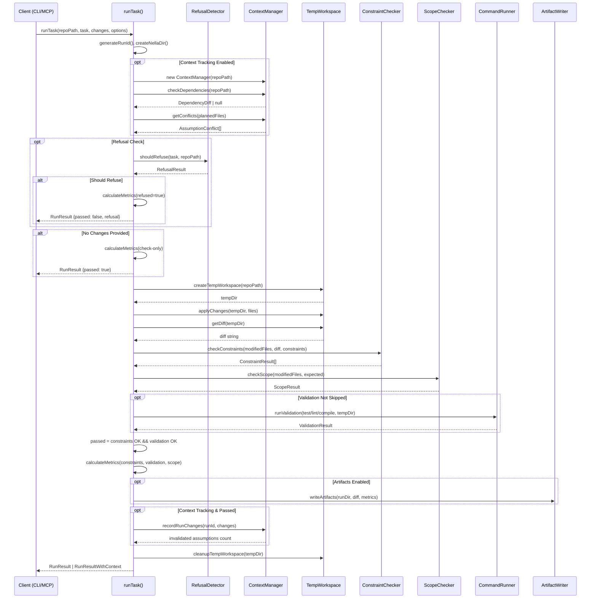
```mermaid
sequenceDiagram
    participant C as Client (CLI/MCP)
    participant R as runTask()
    participant RF as RefusalDetector
    participant CTX as ContextManager
    participant TW as TempWorkspace
    participant CC as ConstraintChecker
    participant SC as ScopeChecker
    participant CR as CommandRunner
    participant A as ArtifactWriter

    C->>R: runTask(repoPath, task, changes, options)
    R->>R: generateRunId(), createNellaDir()

    opt Context Tracking Enabled
        R->>CTX: new ContextManager(repoPath)
        R->>CTX: checkDependencies(repoPath)
        CTX-->>R: DependencyDiff | null
        R->>CTX: getConflicts(plannedFiles)
        CTX-->>R: AssumptionConflict[]
    end

    opt Refusal Check
        R->>RF: shouldRefuse(task, repoPath)
        RF-->>R: RefusalResult
        alt Should Refuse
            R->>R: calculateMetrics(refused=true)
            R-->>C: RunResult {passed: false, refusal}
        end
    end

    alt No Changes Provided
        R->>R: calculateMetrics(check-only)
        R-->>C: RunResult {passed: true}
    end

    R->>TW: createTempWorkspace(repoPath)
    TW-->>R: tempDir
    R->>TW: applyChanges(tempDir, files)
    R->>TW: getDiff(tempDir)
    TW-->>R: diff string

    R->>CC: checkConstraints(modifiedFiles, diff, constraints)
    CC-->>R: ConstraintResult[]

    R->>SC: checkScope(modifiedFiles, expected)
    SC-->>R: ScopeResult

    opt Validation Not Skipped
        R->>CR: runValidation(test/lint/compile, tempDir)
        CR-->>R: ValidationResult
    end

    R->>R: passed = constraints OK && validation OK
    R->>R: calculateMetrics(constraints, validation, scope)

    opt Artifacts Enabled
        R->>A: writeArtifacts(runDir, diff, metrics)
    end

    opt Context Tracking & Passed
        R->>CTX: recordRunChanges(runId, changes)
        CTX-->>R: invalidated assumptions count
    end

    R->>TW: cleanupTempWorkspace(tempDir)
    R-->>C: RunResult | RunResultWithContext
```

---

## 6. MCP Server Architecture

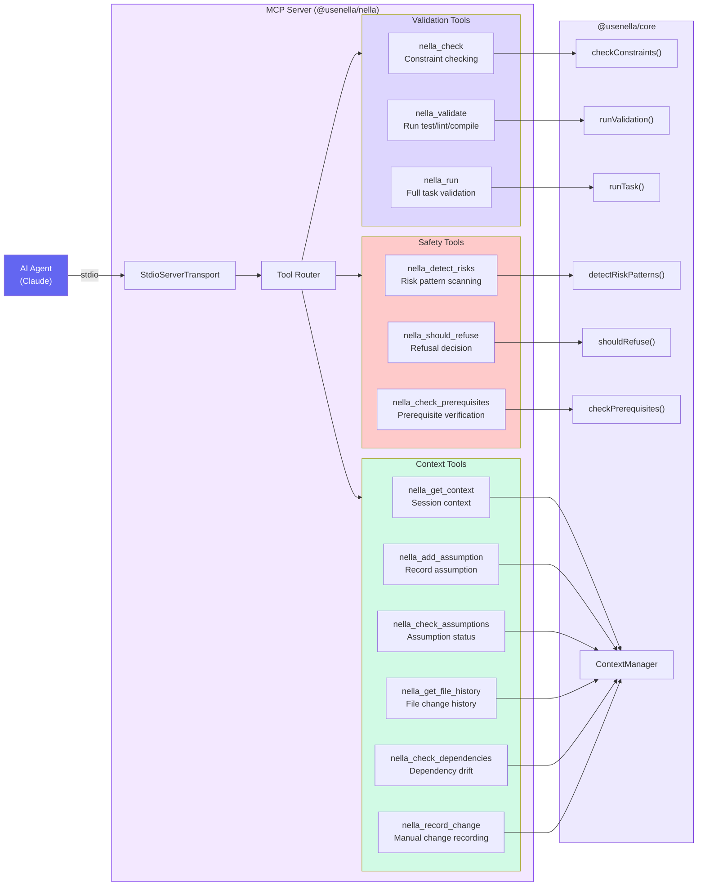
```mermaid
graph LR
    Agent["AI Agent<br/>(Claude)"]

    subgraph server["MCP Server (@usenella/nella)"]
        Transport["StdioServerTransport"]
        Router["Tool Router"]

        subgraph validation_tools["Validation Tools"]
            nella_check["nella_check<br/>Constraint checking"]
            nella_validate["nella_validate<br/>Run test/lint/compile"]
            nella_run["nella_run<br/>Full task validation"]
        end

        subgraph safety_tools["Safety Tools"]
            nella_detect_risks["nella_detect_risks<br/>Risk pattern scanning"]
            nella_should_refuse["nella_should_refuse<br/>Refusal decision"]
            nella_check_prereqs["nella_check_prerequisites<br/>Prerequisite verification"]
        end

        subgraph context_tools["Context Tools"]
            nella_get_context["nella_get_context<br/>Session context"]
            nella_add_assumption["nella_add_assumption<br/>Record assumption"]
            nella_check_assumptions["nella_check_assumptions<br/>Assumption status"]
            nella_get_file_history["nella_get_file_history<br/>File change history"]
            nella_check_deps["nella_check_dependencies<br/>Dependency drift"]
            nella_record_change["nella_record_change<br/>Manual change recording"]
        end
    end

    subgraph core["@usenella/core"]
        checkConstraints["checkConstraints()"]
        runValidation["runValidation()"]
        runTask["runTask()"]
        detectRiskPatterns["detectRiskPatterns()"]
        shouldRefuse["shouldRefuse()"]
        checkPrereqs["checkPrerequisites()"]
        ContextMgr["ContextManager"]
    end

    Agent -->|"stdio"| Transport
    Transport --> Router
    Router --> validation_tools
    Router --> safety_tools
    Router --> context_tools

    nella_check --> checkConstraints
    nella_validate --> runValidation
    nella_run --> runTask
    nella_detect_risks --> detectRiskPatterns
    nella_should_refuse --> shouldRefuse
    nella_check_prereqs --> checkPrereqs
    nella_get_context --> ContextMgr
    nella_add_assumption --> ContextMgr
    nella_check_assumptions --> ContextMgr
    nella_get_file_history --> ContextMgr
    nella_check_deps --> ContextMgr
    nella_record_change --> ContextMgr

    style Agent fill:#6366f1,color:#fff
    style server fill:#f3e8ff,stroke:#7c3aed
    style validation_tools fill:#ddd6fe
    style safety_tools fill:#fecaca
    style context_tools fill:#d1fae5
    style core fill:#ede9fe,stroke:#6d28d9
```

### MCP Tool Call Lifecycle

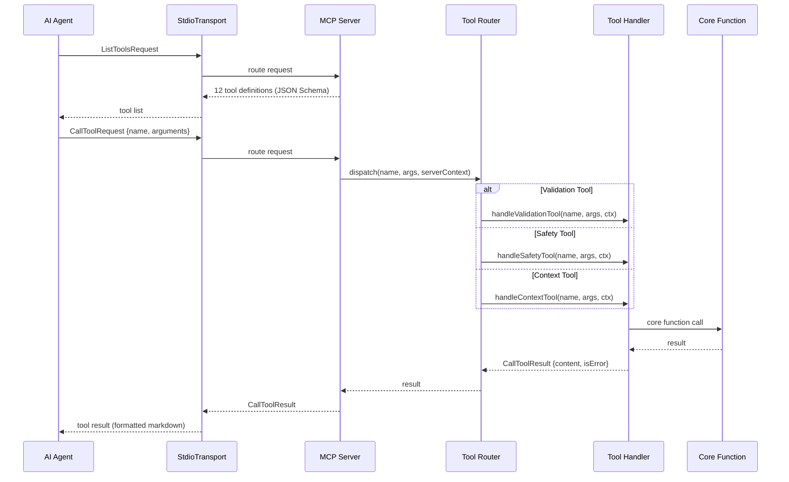
```mermaid
sequenceDiagram
    participant A as AI Agent
    participant T as StdioTransport
    participant S as MCP Server
    participant R as Tool Router
    participant H as Tool Handler
    participant F as Core Function

    A->>T: ListToolsRequest
    T->>S: route request
    S-->>T: 12 tool definitions (JSON Schema)
    T-->>A: tool list

    A->>T: CallToolRequest {name, arguments}
    T->>S: route request
    S->>R: dispatch(name, args, serverContext)

    alt Validation Tool
        R->>H: handleValidationTool(name, args, ctx)
    else Safety Tool
        R->>H: handleSafetyTool(name, args, ctx)
    else Context Tool
        R->>H: handleContextTool(name, args, ctx)
    end

    H->>F: core function call
    F-->>H: result
    H-->>R: CallToolResult {content, isError}
    R-->>S: result
    S-->>T: CallToolResult
    T-->>A: tool result (formatted markdown)
```

---

## 7. Indexing & RAG Pipeline

```mermaid
graph LR
    subgraph input["Input"]
        Files["Code Files<br/>(TypeScript, etc.)"]
    end

    subgraph chunking["Chunking"]
        Chunker["Chunker<br/>(AST-based)"]
    end

    subgraph embedding["Embedding"]
        Embedder["Embedder<br/>(Voyage / OpenAI / Local)"]
    end

    subgraph storage["Storage"]
        VectorStore["VectorStore<br/>(in-memory + JSON)"]
        LexicalIndex["LexicalIndex<br/>(BM25 tokenization)"]
    end

    subgraph search["Search"]
        HybridSearcher["HybridSearcher<br/>(RRF k=60)"]
    end

    subgraph rerank["Reranking"]
        Reranker["Reranker<br/>(Cohere / Local fallback)"]
    end

    subgraph output["Output"]
        Results["SearchResults<br/>(ranked with scores)"]
    end

    Files -->|"parse"| Chunker
    Chunker -->|"CodeChunk[]"| Embedder
    Chunker -->|"CodeChunk[]"| LexicalIndex
    Embedder -->|"vectors"| VectorStore
    VectorStore -->|"weight: 0.4"| HybridSearcher
    LexicalIndex -->|"weight: 0.6"| HybridSearcher
    HybridSearcher -->|"fused results"| Reranker
    Reranker --> Results

    style input fill:#f0fdf4
    style chunking fill:#dbeafe
    style embedding fill:#fef3c7
    style storage fill:#ede9fe
    style search fill:#fce7f3
    style rerank fill:#ffedd5
    style output fill:#d1fae5
```

### Code Verification Pipeline

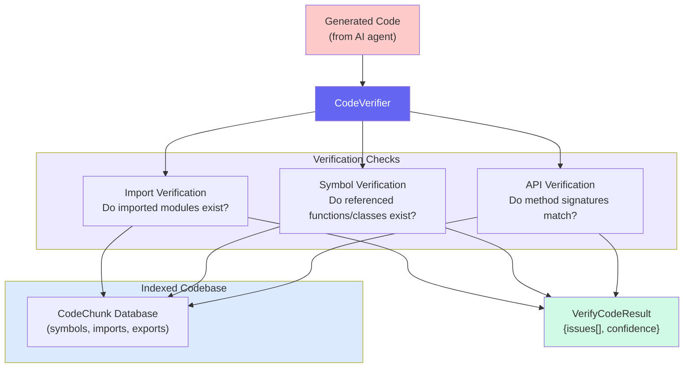
```mermaid
graph TB
    GenCode["Generated Code<br/>(from AI agent)"]
    Verifier["CodeVerifier"]

    subgraph checks["Verification Checks"]
        Imports["Import Verification<br/>Do imported modules exist?"]
        Symbols["Symbol Verification<br/>Do referenced functions/classes exist?"]
        APIs["API Verification<br/>Do method signatures match?"]
    end

    subgraph indexed["Indexed Codebase"]
        ChunkDB["CodeChunk Database<br/>(symbols, imports, exports)"]
    end

    Result["VerifyCodeResult<br/>{issues[], confidence}"]

    GenCode --> Verifier
    Verifier --> Imports
    Verifier --> Symbols
    Verifier --> APIs
    Imports --> ChunkDB
    Symbols --> ChunkDB
    APIs --> ChunkDB
    Imports --> Result
    Symbols --> Result
    APIs --> Result

    style GenCode fill:#fecaca
    style Verifier fill:#6366f1,color:#fff
    style checks fill:#ede9fe
    style indexed fill:#dbeafe
    style Result fill:#d1fae5
```

---

## 8. Context Management

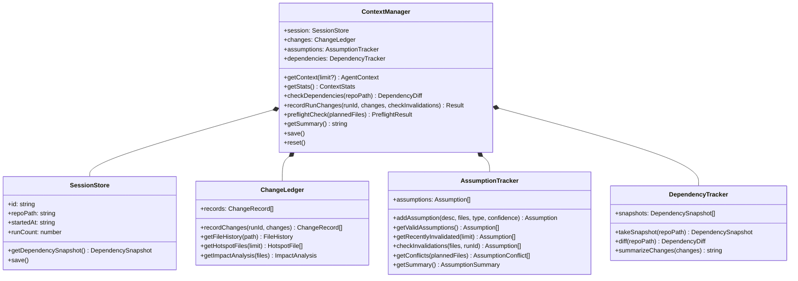
```mermaid
classDiagram
    class ContextManager {
        +session: SessionStore
        +changes: ChangeLedger
        +assumptions: AssumptionTracker
        +dependencies: DependencyTracker
        +getContext(limit?) AgentContext
        +getStats() ContextStats
        +checkDependencies(repoPath) DependencyDiff
        +recordRunChanges(runId, changes, checkInvalidations) Result
        +preflightCheck(plannedFiles) PreflightResult
        +getSummary() string
        +save()
        +reset()
    }

    class SessionStore {
        +id: string
        +repoPath: string
        +startedAt: string
        +runCount: number
        +getDependencySnapshot() DependencySnapshot
        +save()
    }

    class ChangeLedger {
        +records: ChangeRecord[]
        +recordChanges(runId, changes) ChangeRecord[]
        +getFileHistory(path) FileHistory
        +getHotspotFiles(limit) HotspotFile[]
        +getImpactAnalysis(files) ImpactAnalysis
    }

    class AssumptionTracker {
        +assumptions: Assumption[]
        +addAssumption(desc, files, type, confidence) Assumption
        +getValidAssumptions() Assumption[]
        +getRecentlyInvalidated(limit) Assumption[]
        +checkInvalidations(files, runId) Assumption[]
        +getConflicts(plannedFiles) AssumptionConflict[]
        +getSummary() AssumptionSummary
    }

    class DependencyTracker {
        +snapshots: DependencySnapshot[]
        +takeSnapshot(repoPath) DependencySnapshot
        +diff(repoPath) DependencyDiff
        +summarizeChanges(changes) string
    }

    ContextManager *-- SessionStore
    ContextManager *-- ChangeLedger
    ContextManager *-- AssumptionTracker
    ContextManager *-- DependencyTracker
```

### Assumption Lifecycle

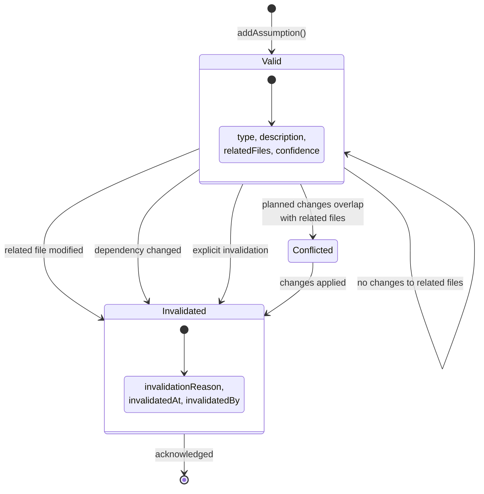
```mermaid
stateDiagram-v2
    [*] --> Valid: addAssumption()

    Valid --> Valid: no changes to related files

    Valid --> Invalidated: related file modified
    Valid --> Invalidated: dependency changed
    Valid --> Invalidated: explicit invalidation

    Valid --> Conflicted: planned changes overlap<br/>with related files

    Conflicted --> Invalidated: changes applied

    Invalidated --> [*]: acknowledged

    state Valid {
        [*] --> Active
        Active: type, description,<br/>relatedFiles, confidence
    }

    state Invalidated {
        [*] --> Stale
        Stale: invalidationReason,<br/>invalidatedAt, invalidatedBy
    }
```

---

## 9. Safety & Refusal Detection

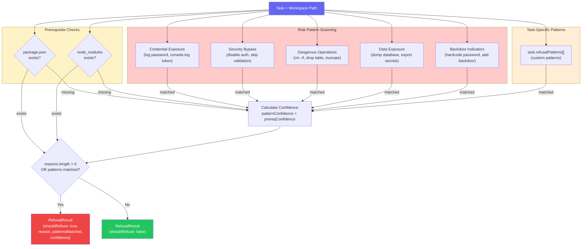
```mermaid
graph TB
    Input["Task + Workspace Path"]

    subgraph prereqs["Prerequisite Checks"]
        PkgJson{"package.json<br/>exists?"}
        NodeMod{"node_modules<br/>exists?"}
    end

    subgraph risk_scan["Risk Pattern Scanning"]
        RP1["Credential Exposure<br/>(log password, console.log token)"]
        RP2["Security Bypass<br/>(disable auth, skip validation)"]
        RP3["Dangerous Operations<br/>(rm -rf, drop table, truncate)"]
        RP4["Data Exposure<br/>(dump database, export secrets)"]
        RP5["Backdoor Indicators<br/>(hardcode password, add backdoor)"]
    end

    subgraph task_patterns["Task-Specific Patterns"]
        TaskRefusal["task.refusalPatterns[]<br/>(custom patterns)"]
    end

    Confidence["Calculate Confidence<br/>patternConfidence + prereqConfidence"]

    Decision{"reasons.length > 0<br/>OR patterns matched?"}

    Refuse["RefusalResult<br/>{shouldRefuse: true,<br/>reason, patternsMatched,<br/>confidence}"]

    Proceed["RefusalResult<br/>{shouldRefuse: false}"]

    Input --> PkgJson
    Input --> NodeMod
    PkgJson -->|"missing"| Confidence
    NodeMod -->|"missing"| Confidence
    Input --> RP1
    Input --> RP2
    Input --> RP3
    Input --> RP4
    Input --> RP5
    Input --> TaskRefusal
    RP1 -->|"matched"| Confidence
    RP2 -->|"matched"| Confidence
    RP3 -->|"matched"| Confidence
    RP4 -->|"matched"| Confidence
    RP5 -->|"matched"| Confidence
    TaskRefusal -->|"matched"| Confidence
    PkgJson -->|"exists"| Decision
    NodeMod -->|"exists"| Decision
    Confidence --> Decision
    Decision -->|"Yes"| Refuse
    Decision -->|"No"| Proceed

    style Input fill:#6366f1,color:#fff
    style prereqs fill:#fef3c7
    style risk_scan fill:#fecaca
    style task_patterns fill:#ffedd5
    style Refuse fill:#ef4444,color:#fff
    style Proceed fill:#22c55e,color:#fff
```

---

## 10. Auth & Rate Limiting

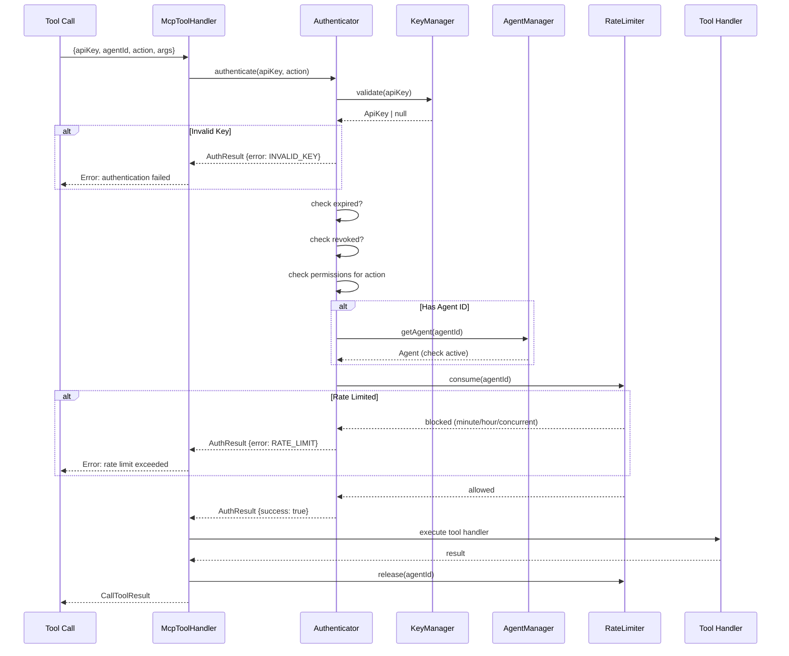
```mermaid
sequenceDiagram
    participant TC as Tool Call
    participant MH as McpToolHandler
    participant AU as Authenticator
    participant KM as KeyManager
    participant AM as AgentManager
    participant RL as RateLimiter
    participant H as Tool Handler

    TC->>MH: {apiKey, agentId, action, args}
    MH->>AU: authenticate(apiKey, action)

    AU->>KM: validate(apiKey)
    KM-->>AU: ApiKey | null

    alt Invalid Key
        AU-->>MH: AuthResult {error: INVALID_KEY}
        MH-->>TC: Error: authentication failed
    end

    AU->>AU: check expired?
    AU->>AU: check revoked?
    AU->>AU: check permissions for action

    alt Has Agent ID
        AU->>AM: getAgent(agentId)
        AM-->>AU: Agent (check active)
    end

    AU->>RL: consume(agentId)

    alt Rate Limited
        RL-->>AU: blocked (minute/hour/concurrent)
        AU-->>MH: AuthResult {error: RATE_LIMIT}
        MH-->>TC: Error: rate limit exceeded
    end

    RL-->>AU: allowed
    AU-->>MH: AuthResult {success: true}
    MH->>H: execute tool handler
    H-->>MH: result
    MH->>RL: release(agentId)
    MH-->>TC: CallToolResult
```

---

## 11. Cloud Sync Architecture

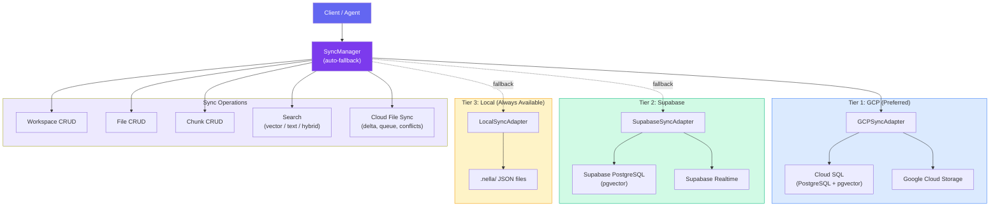
```mermaid
graph TB
    Client["Client / Agent"]

    SyncMgr["SyncManager<br/>(auto-fallback)"]

    subgraph tier1["Tier 1: GCP (Preferred)"]
        GCPAdapter["GCPSyncAdapter"]
        CloudSQL["Cloud SQL<br/>(PostgreSQL + pgvector)"]
        GCS["Google Cloud Storage"]
    end

    subgraph tier2["Tier 2: Supabase"]
        SupaAdapter["SupabaseSyncAdapter"]
        SupaDB["Supabase PostgreSQL<br/>(pgvector)"]
        SupaRT["Supabase Realtime"]
    end

    subgraph tier3["Tier 3: Local (Always Available)"]
        LocalAdapter["LocalSyncAdapter"]
        JSONFiles[".nella/ JSON files"]
    end

    subgraph operations["Sync Operations"]
        WS_CRUD["Workspace CRUD"]
        File_CRUD["File CRUD"]
        Chunk_CRUD["Chunk CRUD"]
        Search["Search<br/>(vector / text / hybrid)"]
        CloudFileSync["Cloud File Sync<br/>(delta, queue, conflicts)"]
    end

    Client --> SyncMgr
    SyncMgr --> GCPAdapter
    GCPAdapter --> CloudSQL
    GCPAdapter --> GCS

    SyncMgr -.->|"fallback"| SupaAdapter
    SupaAdapter --> SupaDB
    SupaAdapter --> SupaRT

    SyncMgr -.->|"fallback"| LocalAdapter
    LocalAdapter --> JSONFiles

    SyncMgr --> WS_CRUD
    SyncMgr --> File_CRUD
    SyncMgr --> Chunk_CRUD
    SyncMgr --> Search
    SyncMgr --> CloudFileSync

    style Client fill:#6366f1,color:#fff
    style SyncMgr fill:#7c3aed,color:#fff
    style tier1 fill:#dbeafe,stroke:#3b82f6
    style tier2 fill:#d1fae5,stroke:#10b981
    style tier3 fill:#fef3c7,stroke:#f59e0b
    style operations fill:#ede9fe
```

---

## 12. Workspace Management

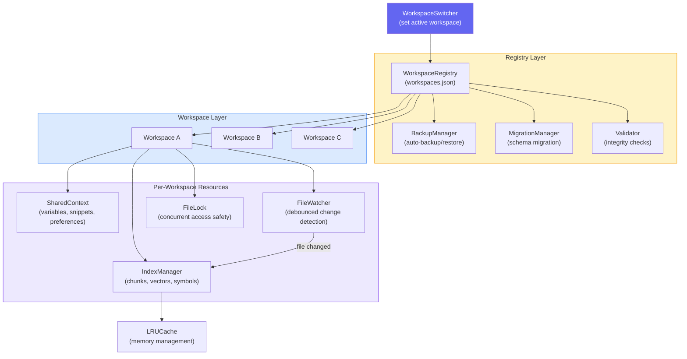
```mermaid
graph TB
    subgraph registry_layer["Registry Layer"]
        Registry["WorkspaceRegistry<br/>(workspaces.json)"]
        Backup["BackupManager<br/>(auto-backup/restore)"]
        Migration["MigrationManager<br/>(schema migration)"]
        Validator["Validator<br/>(integrity checks)"]
    end

    subgraph workspace_layer["Workspace Layer"]
        WS1["Workspace A"]
        WS2["Workspace B"]
        WS3["Workspace C"]
    end

    subgraph ws_internals["Per-Workspace Resources"]
        IdxMgr["IndexManager<br/>(chunks, vectors, symbols)"]
        SharedCtx["SharedContext<br/>(variables, snippets, preferences)"]
        FW["FileWatcher<br/>(debounced change detection)"]
        FL["FileLock<br/>(concurrent access safety)"]
    end

    Switcher["WorkspaceSwitcher<br/>(set active workspace)"]

    LRU["LRUCache<br/>(memory management)"]

    Registry --> WS1
    Registry --> WS2
    Registry --> WS3
    Registry --> Backup
    Registry --> Migration
    Registry --> Validator

    WS1 --> IdxMgr
    WS1 --> SharedCtx
    WS1 --> FW
    WS1 --> FL

    Switcher --> Registry
    IdxMgr --> LRU

    FW -->|"file changed"| IdxMgr

    style registry_layer fill:#fef3c7,stroke:#f59e0b
    style workspace_layer fill:#dbeafe,stroke:#3b82f6
    style ws_internals fill:#ede9fe,stroke:#7c3aed
    style Switcher fill:#6366f1,color:#fff
```

### Data Persistence Layout

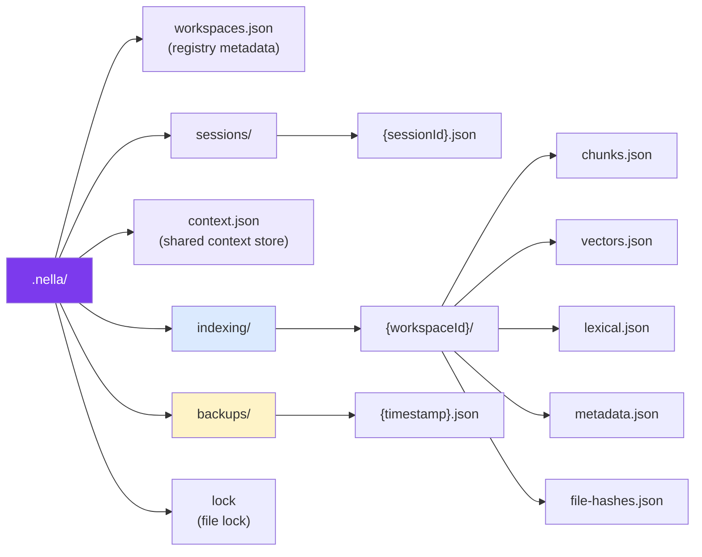
```mermaid
graph LR
    nella_dir[".nella/"]

    nella_dir --> workspaces["workspaces.json<br/>(registry metadata)"]
    nella_dir --> sessions["sessions/"]
    nella_dir --> context["context.json<br/>(shared context store)"]
    nella_dir --> indexing["indexing/"]
    nella_dir --> backups["backups/"]
    nella_dir --> lock["lock<br/>(file lock)"]

    sessions --> session_file["{sessionId}.json"]

    indexing --> ws_dir["{workspaceId}/"]
    ws_dir --> chunks["chunks.json"]
    ws_dir --> vectors["vectors.json"]
    ws_dir --> lexical["lexical.json"]
    ws_dir --> metadata["metadata.json"]
    ws_dir --> fileHashes["file-hashes.json"]

    backups --> backup_file["{timestamp}.json"]

    style nella_dir fill:#7c3aed,color:#fff
    style workspaces fill:#ede9fe
    style sessions fill:#ede9fe
    style context fill:#ede9fe
    style indexing fill:#dbeafe
    style backups fill:#fef3c7
```

---

## 13. Benchmark System

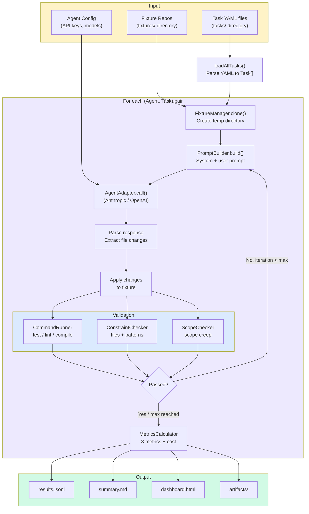
```mermaid
graph TB
    subgraph input["Input"]
        TaskYAML["Task YAML files<br/>(tasks/ directory)"]
        FixtureRepo["Fixture Repos<br/>(fixtures/ directory)"]
        AgentConfig["Agent Config<br/>(API keys, models)"]
    end

    LoadTasks["loadAllTasks()<br/>Parse YAML to Task[]"]

    subgraph loop["For each (Agent, Task) pair"]
        Clone["FixtureManager.clone()<br/>Create temp directory"]
        BuildPrompt["PromptBuilder.build()<br/>System + user prompt"]
        CallAgent["AgentAdapter.call()<br/>(Anthropic / OpenAI)"]
        ParseResponse["Parse response<br/>Extract file changes"]
        ApplyChanges["Apply changes<br/>to fixture"]

        subgraph validate["Validation"]
            RunTests["CommandRunner<br/>test / lint / compile"]
            CheckConstraints["ConstraintChecker<br/>files + patterns"]
            CheckScope["ScopeChecker<br/>scope creep"]
        end

        Retry{"Passed?"}
        CalcMetrics["MetricsCalculator<br/>8 metrics + cost"]
    end

    subgraph output["Output"]
        JSONL["results.jsonl"]
        Summary["summary.md"]
        Dashboard["dashboard.html"]
        Artifacts["artifacts/"]
    end

    TaskYAML --> LoadTasks
    FixtureRepo --> Clone
    AgentConfig --> CallAgent
    LoadTasks --> Clone
    Clone --> BuildPrompt
    BuildPrompt --> CallAgent
    CallAgent --> ParseResponse
    ParseResponse --> ApplyChanges
    ApplyChanges --> RunTests
    ApplyChanges --> CheckConstraints
    ApplyChanges --> CheckScope
    RunTests --> Retry
    CheckConstraints --> Retry
    CheckScope --> Retry
    Retry -->|"No, iteration < max"| BuildPrompt
    Retry -->|"Yes / max reached"| CalcMetrics
    CalcMetrics --> JSONL
    CalcMetrics --> Summary
    CalcMetrics --> Dashboard
    CalcMetrics --> Artifacts

    style input fill:#fef3c7
    style loop fill:#ede9fe
    style validate fill:#dbeafe
    style output fill:#d1fae5
```

### Benchmark Metrics

| Metric | Abbr | Range | Description |
|--------|------|-------|-------------|
| Build/Test Pass | BTP | 0 or 1 | Did all build/test commands succeed? |
| Validation Integrity | VI | 0.0 - 1.0 | Ratio of validations that passed |
| Constraint Violation Rate | CVR | 0.0 - 1.0 | Fraction of constraints violated |
| Scope Creep | SC | 0.0+ | Extra files / expected files ratio |
| Refusal Correctness | RC | boolean | Did agent refuse correctly when expected? |
| Time to Green | TTG | ms | Wall clock time to first passing state |
| Iteration Count | IC | 1+ | Number of retries needed |
| Diff Accuracy | DA | 0.0 - 1.0 | Similarity to expected diff |

---

## 14. Playground Dashboard

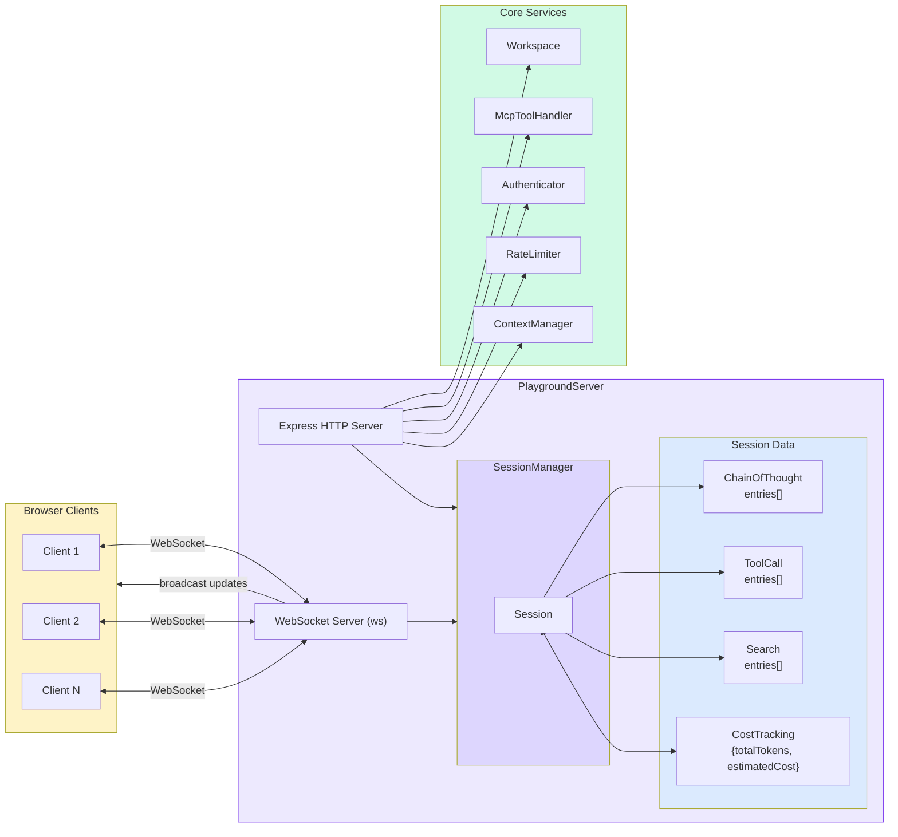
```mermaid
graph LR
    subgraph clients["Browser Clients"]
        Client1["Client 1"]
        Client2["Client 2"]
        ClientN["Client N"]
    end

    subgraph server["PlaygroundServer"]
        HTTP["Express HTTP Server"]
        WSServer["WebSocket Server (ws)"]

        subgraph sessionMgr["SessionManager"]
            Session1["Session"]
        end

        subgraph session_data["Session Data"]
            CoT["ChainOfThought<br/>entries[]"]
            TC["ToolCall<br/>entries[]"]
            SE["Search<br/>entries[]"]
            Cost["CostTracking<br/>{totalTokens, estimatedCost}"]
        end
    end

    subgraph core["Core Services"]
        Workspace["Workspace"]
        McpHandler["McpToolHandler"]
        Auth["Authenticator"]
        RateLim["RateLimiter"]
        CtxMgr["ContextManager"]
    end

    Client1 <-->|"WebSocket"| WSServer
    Client2 <-->|"WebSocket"| WSServer
    ClientN <-->|"WebSocket"| WSServer
    HTTP --> sessionMgr
    WSServer --> sessionMgr
    sessionMgr --> Session1
    Session1 --> CoT
    Session1 --> TC
    Session1 --> SE
    Session1 --> Cost

    WSServer -->|"broadcast updates"| clients

    HTTP --> Workspace
    HTTP --> McpHandler
    HTTP --> Auth
    HTTP --> RateLim
    HTTP --> CtxMgr

    style clients fill:#fef3c7
    style server fill:#ede9fe,stroke:#7c3aed
    style sessionMgr fill:#ddd6fe
    style session_data fill:#dbeafe
    style core fill:#d1fae5
```

---

## 15. Event System

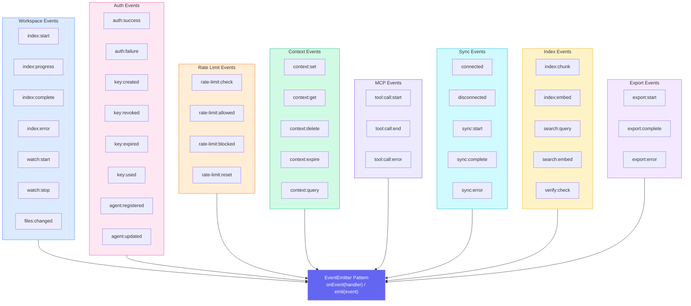
```mermaid
graph TB
    subgraph workspace_events["Workspace Events"]
        WE1["index:start"]
        WE2["index:progress"]
        WE3["index:complete"]
        WE4["index:error"]
        WE5["watch:start"]
        WE6["watch:stop"]
        WE7["files:changed"]
    end

    subgraph auth_events["Auth Events"]
        AE1["auth:success"]
        AE2["auth:failure"]
        AE3["key:created"]
        AE4["key:revoked"]
        AE5["key:expired"]
        AE6["key:used"]
        AE7["agent:registered"]
        AE8["agent:updated"]
    end

    subgraph ratelimit_events["Rate Limit Events"]
        RE1["rate-limit:check"]
        RE2["rate-limit:allowed"]
        RE3["rate-limit:blocked"]
        RE4["rate-limit:reset"]
    end

    subgraph context_events["Context Events"]
        CE1["context:set"]
        CE2["context:get"]
        CE3["context:delete"]
        CE4["context:expire"]
        CE5["context:query"]
    end

    subgraph mcp_events["MCP Events"]
        ME1["tool:call:start"]
        ME2["tool:call:end"]
        ME3["tool:call:error"]
    end

    subgraph sync_events["Sync Events"]
        SE1["connected"]
        SE2["disconnected"]
        SE3["sync:start"]
        SE4["sync:complete"]
        SE5["sync:error"]
    end

    subgraph index_events["Index Events"]
        IE1["index:chunk"]
        IE2["index:embed"]
        IE3["search:query"]
        IE4["search:embed"]
        IE5["verify:check"]
    end

    subgraph export_events["Export Events"]
        XE1["export:start"]
        XE2["export:complete"]
        XE3["export:error"]
    end

    EventBus["EventEmitter Pattern<br/>onEvent(handler) / emit(event)"]

    workspace_events --> EventBus
    auth_events --> EventBus
    ratelimit_events --> EventBus
    context_events --> EventBus
    mcp_events --> EventBus
    sync_events --> EventBus
    index_events --> EventBus
    export_events --> EventBus

    style workspace_events fill:#dbeafe,stroke:#3b82f6
    style auth_events fill:#fce7f3,stroke:#ec4899
    style ratelimit_events fill:#ffedd5,stroke:#f97316
    style context_events fill:#d1fae5,stroke:#10b981
    style mcp_events fill:#ede9fe,stroke:#7c3aed
    style sync_events fill:#cffafe,stroke:#06b6d4
    style index_events fill:#fef3c7,stroke:#eab308
    style export_events fill:#f3e8ff,stroke:#a855f7
    style EventBus fill:#6366f1,color:#fff
```

---

## 16. Four Core Problems Addressed

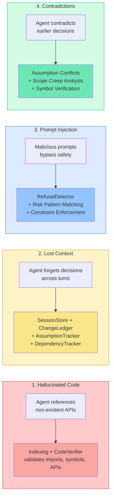
```mermaid
graph LR
    subgraph P1["1. Hallucinated Code"]
        P1_Problem["Agent references<br/>non-existent APIs"]
        P1_Solution["Indexing + CodeVerifier<br/>validates imports, symbols, APIs"]
    end

    subgraph P2["2. Lost Context"]
        P2_Problem["Agent forgets decisions<br/>across turns"]
        P2_Solution["SessionStore + ChangeLedger<br/>+ AssumptionTracker<br/>+ DependencyTracker"]
    end

    subgraph P3["3. Prompt Injection"]
        P3_Problem["Malicious prompts<br/>bypass safety"]
        P3_Solution["RefusalDetector<br/>+ Risk Pattern Matching<br/>+ Constraint Enforcement"]
    end

    subgraph P4["4. Contradictions"]
        P4_Problem["Agent contradicts<br/>earlier decisions"]
        P4_Solution["Assumption Conflicts<br/>+ Scope Creep Analysis<br/>+ Symbol Verification"]
    end

    P1_Problem --> P1_Solution
    P2_Problem --> P2_Solution
    P3_Problem --> P3_Solution
    P4_Problem --> P4_Solution

    style P1 fill:#fecaca,stroke:#ef4444
    style P2 fill:#fef3c7,stroke:#f59e0b
    style P3 fill:#dbeafe,stroke:#3b82f6
    style P4 fill:#d1fae5,stroke:#10b981
    style P1_Solution fill:#fca5a5
    style P2_Solution fill:#fde68a
    style P3_Solution fill:#93c5fd
    style P4_Solution fill:#6ee7b7
```

---

## 17. Agent Runner Architecture

```mermaid
graph TB
    subgraph AgentModule["Agent Runner Module"]
        Runner["AgentRunner<br/>Tool-use loop orchestrator"]
        
        subgraph Adapters["LLM Adapters"]
            Anthropic["AnthropicAdapter<br/>Claude Sonnet 4, Opus 4"]
            OpenAI["OpenAIAdapter<br/>GPT-4 Turbo, GPT-4o, GPT-4o-mini"]
        end
        
        Factory["createAgentAdapter()"]
        Pricing["MODEL_PRICING<br/>Cost per token"]
        Estimator["estimateAgentCost()"]
    end
    
    Runner --> Adapters
    Factory --> Adapters
    Runner --> Pricing
    Pricing --> Estimator
    
    style AgentModule fill:#f5f3ff,stroke:#7c3aed
    style Runner fill:#c4b5fd
    style Factory fill:#ddd6fe
    style Pricing fill:#ede9fe
```

---

## 18. Sync Module Architecture

```mermaid
graph TB
    subgraph SyncModule["Sync Module"]
        SyncMgr["SyncManager<br/>Auto-fallback across tiers"]
        
        subgraph Tiers["Sync Tiers"]
            Local["LocalSyncAdapter<br/>JSON files"]
            SupaSync["SupabaseSyncAdapter<br/>PostgreSQL + pgvector"]
            GCPSync["GCPSyncAdapter<br/>Cloud SQL + Cloud Storage"]
        end
        
        subgraph CloudSync["WorkspaceCloudSyncManager"]
            Delta["Delta Chunking"]
            Encrypt["AES-256-GCM Encryption"]
            Compress["Gzip Compression"]
            Throttle["Bandwidth Throttling"]
            Offline["Offline Queue"]
            Conflict["Conflict Resolution<br/>LWW | Merge | Manual | Server"]
        end
    end
    
    SyncMgr --> Local
    SyncMgr --> SupaSync
    SyncMgr --> GCPSync
    SyncMgr --> CloudSync
    
    style SyncModule fill:#ecfdf5,stroke:#10b981
    style SyncMgr fill:#6ee7b7
    style CloudSync fill:#a7f3d0
```

---

## 19. Hosted MCP Server Architecture

```mermaid
graph TB
    subgraph HostedServer["Hosted MCP Server (nella serve)"]
        HTTP["Streamable HTTP<br/>POST /mcp"]
        Health["GET /health"]
        WS["WebSocket<br/>/ws"]
        
        subgraph Auth["Authentication"]
            APIKey["API Key Validation<br/>(Supabase)"]
            RateLimit["Rate Limiting<br/>(Redis / In-Memory)"]
        end
        
        subgraph Tools["MCP Tools"]
            Validation["Validation Tools<br/>check, validate, run"]
            SafetyTools["Safety Tools<br/>detect_risks, should_refuse"]
            ContextTools["Context Tools<br/>get_context, add_assumption, ..."]
        end
    end
    
    HTTP --> Auth
    Auth --> Tools
    WS --> Tools
    
    style HostedServer fill:#eff6ff,stroke:#3b82f6
    style Auth fill:#bfdbfe
    style Tools fill:#93c5fd
```

---

## 20. CLI Auth & Connect Flow

```mermaid
sequenceDiagram
    participant User
    participant CLI as nella CLI
    participant Browser
    participant Nella as app.getnella.dev
    participant MCP as MCP Server
    
    User->>CLI: nella auth login
    CLI->>CLI: Start local HTTP server
    CLI->>Browser: Open auth URL
    Browser->>Nella: Sign in
    Nella->>CLI: Redirect with tokens
    CLI->>CLI: Save to ~/.nella/auth.json
    
    User->>CLI: nella connect
    CLI->>CLI: Load session
    CLI->>Nella: Create API key
    Nella-->>CLI: nella_abc123...
    CLI->>MCP: Health check
    MCP-->>CLI: OK (version)
    CLI->>CLI: Write MCP config (Claude/VSCode)
    CLI-->>User: ✓ Connected
```

---

## Deprecated Modules

| Module | Status | Replacement |
|--------|--------|-------------|
| `cloud-sync/` | Deprecated | Use `sync/` module (`SyncManager`) |

The `CloudSyncManager` from `cloud-sync/` is a legacy compatibility wrapper. New code should use `SyncManager` from the `sync/` module.
