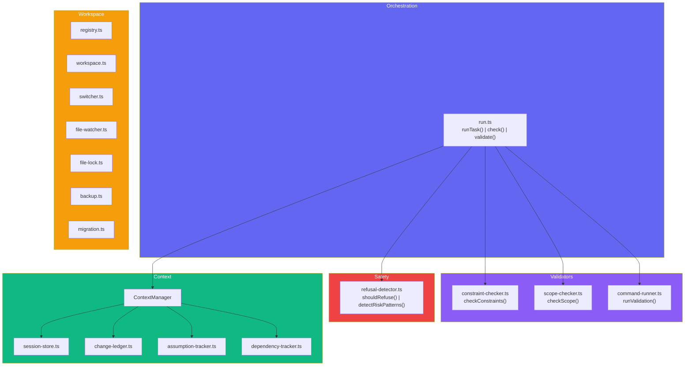
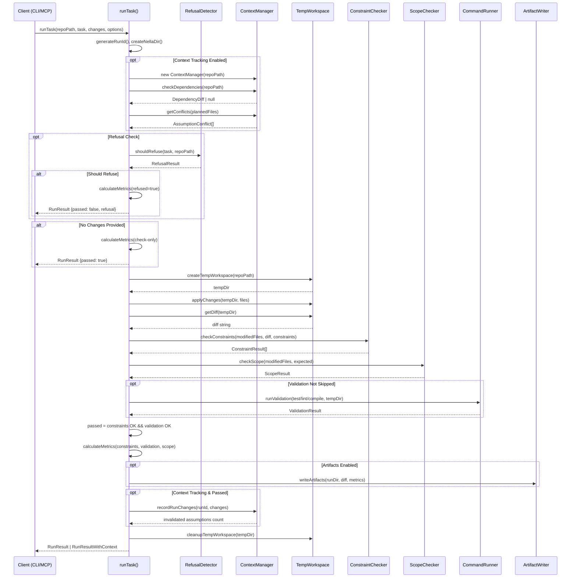
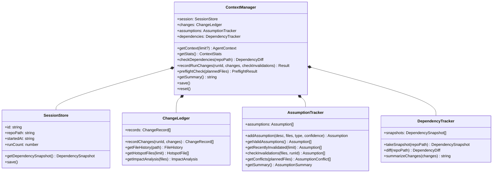
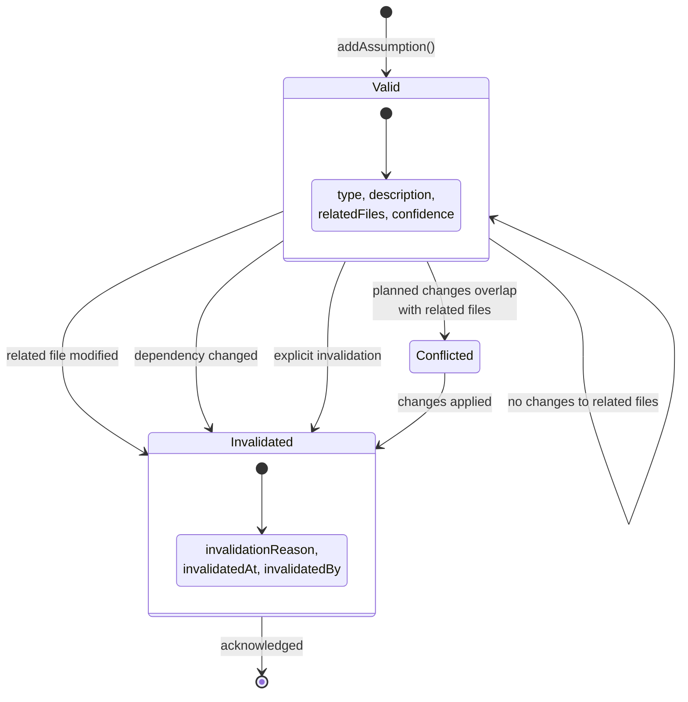
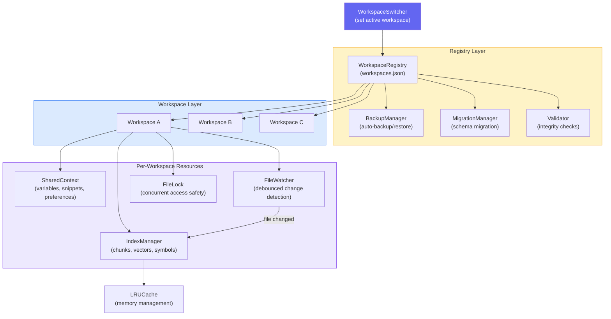
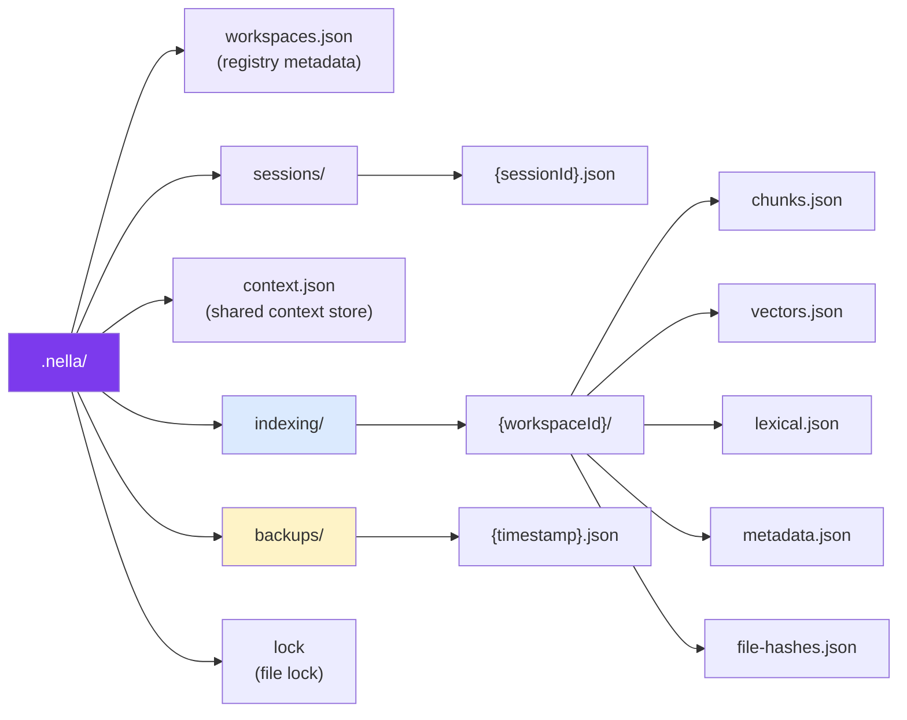
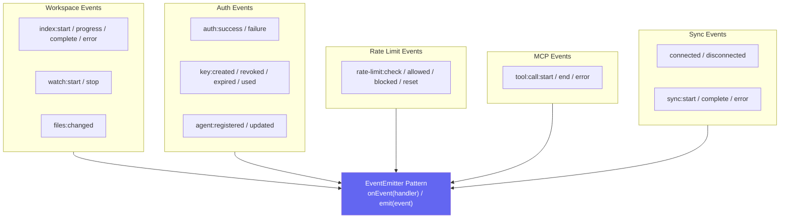

# Core Modules

The `@usenella/core` package contains all of Nella's validation, safety, and tracking logic. This page covers the run engine, validators, context management, workspace management, and the event system.

## Module Architecture

## Task Execution Pipeline

Every `runTask()` call follows this sequence — from receiving the task to returning validated results:

### Pipeline Steps

1. **Run ID generation** — Creates a unique identifier and the `.nella/` working directory
2. **Context preflight** (optional) — Checks for dependency drift and assumption conflicts before proceeding
3. **Refusal check** (optional) — Scans the task description for dangerous patterns; refuses if risk is detected
4. **Workspace setup** — Clones the repo into a temp directory and applies the proposed changes
5. **Diff generation** — Computes the unified diff between original and modified files
6. **Constraint checking** — Validates against protected files, forbidden patterns, and custom constraints
7. **Scope checking** — Compares modified files against expected files to detect scope creep
8. **Validation** — Runs test/lint/compile commands in the temp workspace
9. **Metrics** — Calculates pass/fail, violation rates, scope creep ratio, and timing
10. **Context recording** (optional) — Persists changes and invalidates stale assumptions

## Context Management

The `ContextManager` orchestrates four tracking subsystems that persist across agent turns:

| Subsystem | Purpose | Key Methods |
|-----------|---------|-------------|
| **SessionStore** | Tracks session identity, repo path, run count, and timing | `save()`, `getDependencySnapshot()` |
| **ChangeLedger** | Records every file modification with run ID, operation type, and reason | `getFileHistory()`, `getHotspotFiles()`, `getImpactAnalysis()` |
| **AssumptionTracker** | Manages assumptions with conflict detection and automatic invalidation | `addAssumption()`, `getConflicts()`, `checkInvalidations()` |
| **DependencyTracker** | Snapshots `package.json` + lockfile state and computes diffs | `takeSnapshot()`, `diff()`, `summarizeChanges()` |

### Assumption Lifecycle

Assumptions transition through three states based on file changes and agent actions:

## Workspace Management

### Data Persistence Layout

All Nella data for a project is stored under the `.nella/` directory:

## Event System

All major operations emit events through a standard `EventEmitter` pattern. This enables logging, monitoring, and integration with external tools.

## Related Architecture Pages

- [Architecture Overview](./overview.md) — System topology and package structure
- [MCP Server](./mcp-server.md) — MCP protocol implementation and tool routing
- [Indexing & RAG](./indexing-rag.md) — Code chunking, embedding, and hybrid search
- [Security & Auth](./security-auth.md) — Safety detection, authentication, and rate limiting
