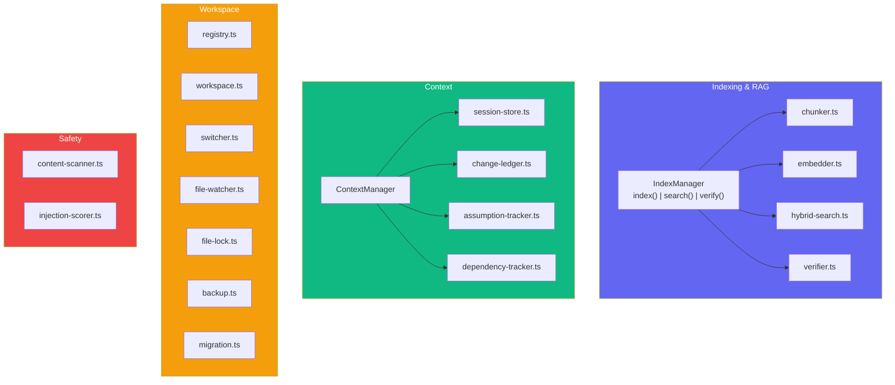
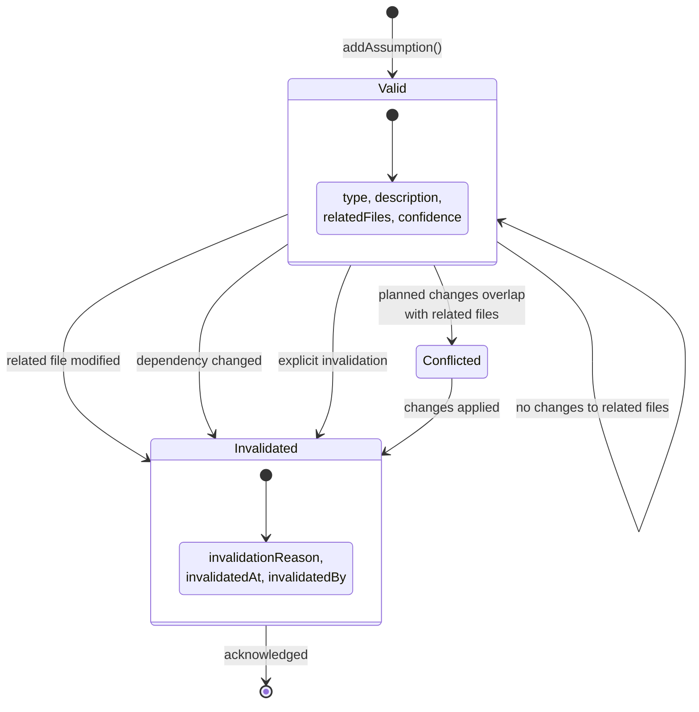
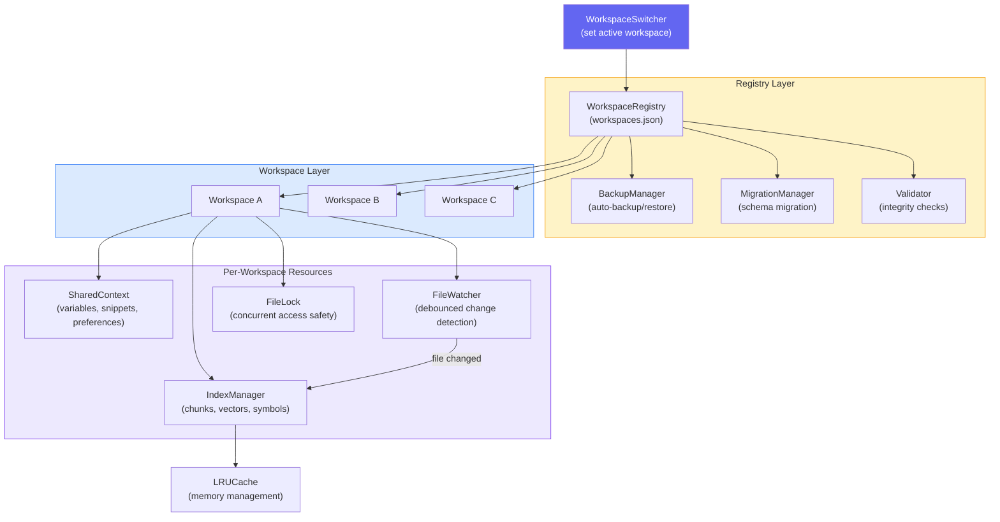
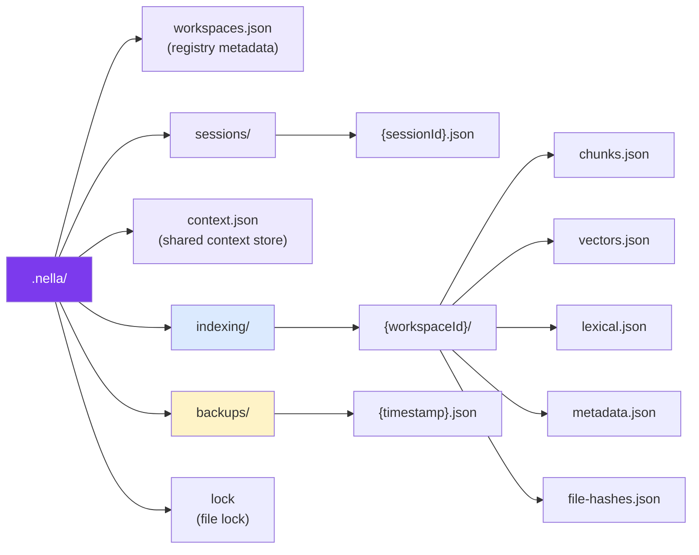
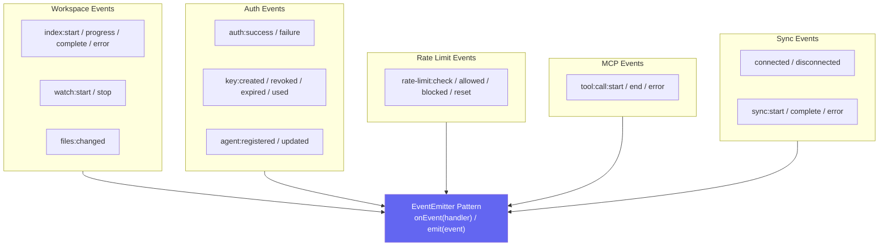

# Core Modules

The `@usenella/core` package contains Nella's indexing, context tracking, workspace management, and safety logic. This page covers the indexing/RAG system, context management, workspace management, and the event system.

## Module Architecture

## Core Flow

The MCP server and CLI route tool calls into two main subsystems:

- **IndexManager** — Indexes the codebase (AST chunking, embedding, hybrid search) and verifies generated code against the index.
- **ContextManager** — Tracks session state, assumptions, change history, and dependency drift across agent turns.

There is no centralized `runTask()` pipeline. Instead, each MCP tool (`nella_search`, `nella_index`, `nella_get_context`, etc.) calls into the relevant manager directly.

## Context Management

The `ContextManager` orchestrates four tracking subsystems that persist across agent turns:

| Subsystem | Purpose | Key Methods |
|-----------|---------|-------------|
| **SessionStore** | Tracks session identity, repo path, run count, and timing | `save()`, `getDependencySnapshot()` |
| **ChangeLedger** | Records every file modification with run ID, operation type, and reason | `getFileHistory()`, `getHotspotFiles()`, `getImpactAnalysis()` |
| **AssumptionTracker** | Manages assumptions with conflict detection and automatic invalidation | `addAssumption()`, `getConflicts()`, `checkInvalidations()` |
| **DependencyTracker** | Snapshots `package.json` + lockfile state and computes diffs | `takeSnapshot()`, `diff()`, `summarizeChanges()` |

### Assumption Lifecycle

Assumptions transition through three states based on file changes and agent actions:

## Workspace Management

### Data Persistence Layout

All Nella data for a project is stored under the `.nella/` directory:

## Event System

All major operations emit events through a standard `EventEmitter` pattern. This enables logging, monitoring, and integration with external tools.

## Related Architecture Pages

- [Architecture Overview](./overview.md) — System topology and package structure
- [MCP Server](./mcp-server.md) — MCP protocol implementation and tool routing
- [Indexing & RAG](./indexing-rag.md) — Code chunking, embedding, and hybrid search
- [Security & Auth](./security-auth.md) — Safety detection, authentication, and rate limiting
