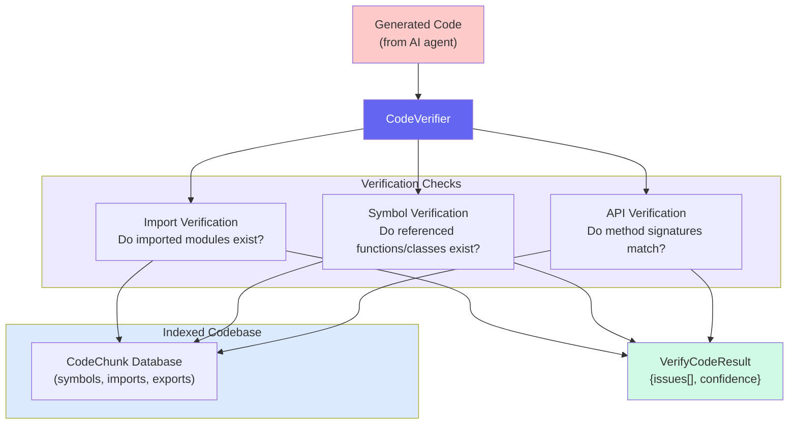

# Indexing & RAG Architecture

Nella indexes your codebase to enable semantic search, code verification, and hallucination detection. This page covers the full Indexing & RAG pipeline — from file parsing through hybrid search and code verification.

## Pipeline Overview

```mermaid
graph LR
    subgraph input["Input"]
        Files["Code Files<br/>(TypeScript, etc.)"]
    end

    subgraph chunking["Chunking"]
        Chunker["Chunker<br/>(AST-based)"]
    end

    subgraph embedding["Embedding"]
        Embedder["Embedder<br/>(Azure OpenAI / Nella)"]
    end

    subgraph storage["Storage"]
        VectorStore["VectorStore<br/>(in-memory + JSON)"]
        LexicalIndex["LexicalIndex<br/>(BM25 tokenization)"]
    end

    subgraph search["Search"]
        HybridSearcher["HybridSearcher<br/>(RRF k=60)"]
    end

    subgraph rerank["Reranking"]
        Reranker["Reranker<br/>(Cohere via Azure / Local fallback)"]
    end

    subgraph output["Output"]
        Results["SearchResults<br/>(ranked with scores)"]
    end

    Files -->|"parse"| Chunker
    Chunker -->|"CodeChunk[]"| Embedder
    Chunker -->|"CodeChunk[]"| LexicalIndex
    Embedder -->|"vectors"| VectorStore
    VectorStore -->|"weight: 0.4"| HybridSearcher
    LexicalIndex -->|"weight: 0.6"| HybridSearcher
    HybridSearcher -->|"fused results"| Reranker
    Reranker --> Results

    style input fill:#f0fdf4
    style chunking fill:#dbeafe
    style embedding fill:#fef3c7
    style storage fill:#ede9fe
    style search fill:#fce7f3
    style rerank fill:#ffedd5
    style output fill:#d1fae5
```



## Pipeline Stages

### 1. Chunking

The **AST-based chunker** parses source files using TypeScript's compiler API and splits code into semantic chunks based on function, class, interface, and type boundaries.

| Feature | Details |
|---------|---------|
| **Parser** | TypeScript compiler API (`ts.createSourceFile`) |
| **Chunk boundaries** | Functions, classes, interfaces, type aliases, exports |
| **Metadata extracted** | File path, line range, symbols defined, imports, exports |
| **Overlap** | Adjacent chunks share 2 lines of context for continuity |

### 2. Embedding

Each chunk is embedded into a vector using a configurable embedding provider:

| Provider | Model | Dimensions | Notes |
|----------|-------|------------|-------|
| **Azure OpenAI** (default) | `text-embedding-3-small` | 1536 | Requires `AZURE_EMBEDDING_API_KEY` and `AZURE_ENDPOINT` |
| **Nella** | `text-embedding-3-small` | 1536 | Authenticated via `nella auth login`; proxied through `app.getnella.dev/api` |

An **SQLite embedding cache** (with JSON fallback) stores computed embeddings by content hash, preventing redundant API calls during incremental re-indexing.

### 3. Storage

- **VectorStore** — In-memory cosine similarity search with JSON persistence. Falls back to brute-force when the optional `usearch` HNSW backend is unavailable.
- **LexicalIndex** — BM25 tokenization with Porter stemming and Levenshtein fuzzy matching for exact symbol lookups.

### 4. Hybrid Search

The **HybridSearcher** combines vector and lexical results using Reciprocal Rank Fusion (RRF):

```
score(d) = Σ 1/(k + rank_i(d))
```

Where `k=60` (default) and `rank_i` is the document's rank in each retrieval source. Default weights: **40% vector + 60% lexical**.

### 5. Reranking (Optional)

When configured, a Cohere reranking model (`Cohere-rerank-v4.0-pro`) deployed via Azure reorders hybrid results for improved relevance. Requires `AZURE_RERANK_API_KEY` and `AZURE_RERANK_ENDPOINT`. Falls back to a local term-overlap reranker when unavailable.

## Code Verification

The **CodeVerifier** validates AI-generated code against the indexed codebase to detect hallucinations:



### Verification Steps

1. **Import verification** — Checks that every `import { X } from 'module'` references a module that exists in the codebase or `node_modules`
2. **Symbol verification** — Confirms that referenced functions, classes, and types are real exports. Provides "did you mean?" suggestions for close matches
3. **API verification** — Validates that method calls use the correct parameter count and types

### Confidence Scoring

The verifier returns a confidence score (0.0–1.0) based on the number and severity of issues found:

| Score Range | Interpretation |
|-------------|---------------|
| 0.0–0.3 | Low confidence — many hallucinated references |
| 0.3–0.7 | Medium — some issues found, likely minor |
| 0.7–1.0 | High confidence — code references are valid |

## Performance Characteristics

Based on benchmarks against a 302-file TypeScript monorepo:

| Operation | Latency | Notes |
|-----------|---------|-------|
| Full index (302 files) | ~88s | 4,495 chunks, 444K tokens |
| Incremental re-index | ~4s | 21x faster (hash-based skip) |
| Semantic search | ~1.3s | Dominated by API round-trip for query embedding |
| Lexical/BM25 search | &lt;2ms | Porter stemming + Levenshtein fuzzy matching |
| Hybrid search | ~1.4s | Semantic + lexical + RRF fusion |
| Code verification | 15–66ms | Symbol lookup against chunk database |

### Index Storage

| File | Size | Content |
|------|------|---------|
| `vectors.json` | ~140 MB | Embedding vectors |
| `chunks.json` | ~133 MB | Chunk content + metadata |
| `embeddings.cache.json` | ~131 MB | Content-hash → embedding cache |
| `lexical.json` | ~2.6 MB | BM25 token index |
| `file-hashes.json` | ~39 KB | File modification tracking |
| `metadata.json` | ~1 KB | Index version + stats |

## Related Architecture Pages

- [Architecture Overview](./overview.md) — System topology and package structure
- [Core Modules](./core-modules.md) — Indexing, context, and workspace modules
- [MCP Server](./mcp-server.md) — MCP protocol implementation and tool routing
- [Security & Auth](./security-auth.md) — Safety detection, authentication, and rate limiting
