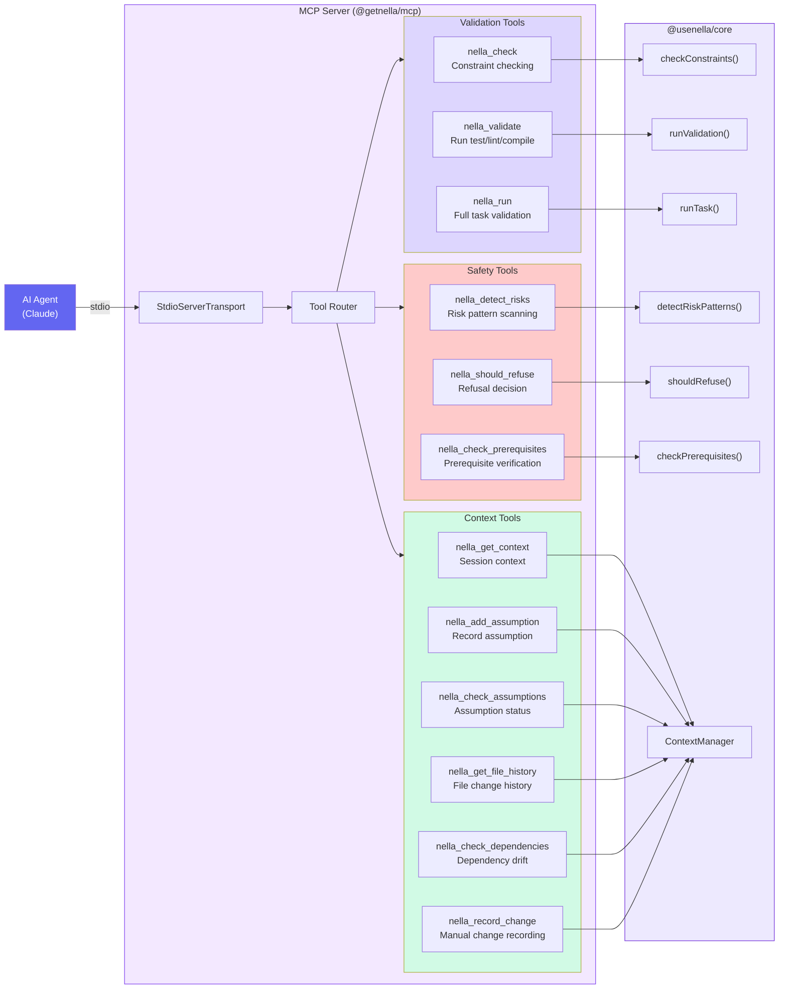
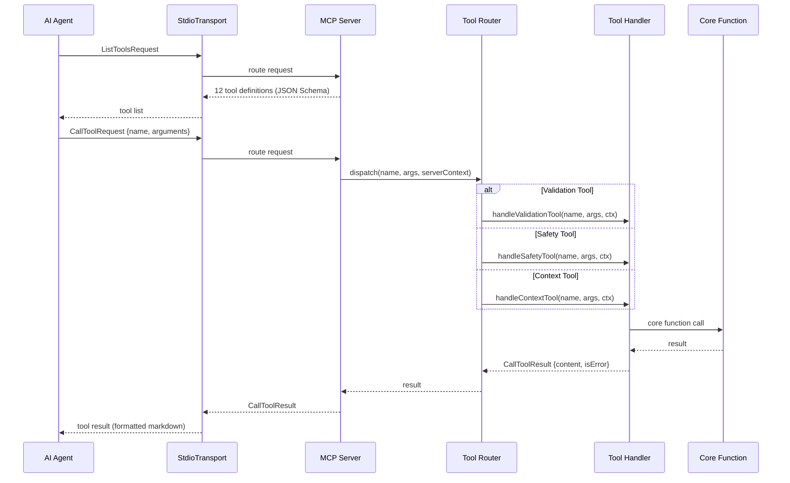
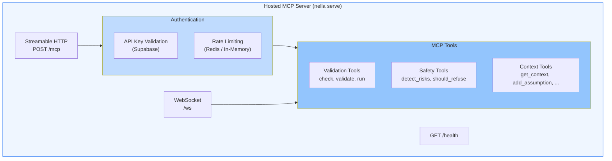
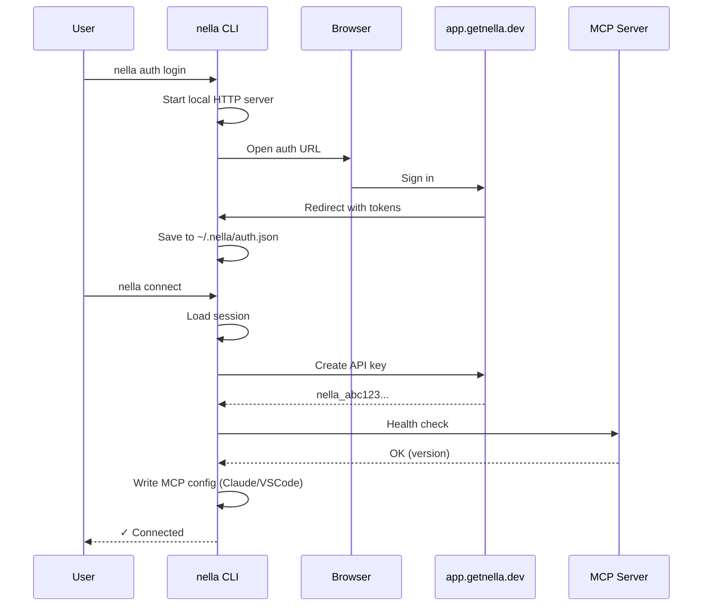

# MCP Server Architecture

Nella exposes its capabilities to AI agents through the Model Context Protocol (MCP). This page covers the MCP server implementation, tool routing, the hosted server variant, and the CLI auth/connect flow.

## Server Architecture

### Tool Categories

| Category | Tools | Purpose |
|----------|-------|---------|
| **Validation** | `nella_check`, `nella_validate`, `nella_run` | Verify code changes against constraints, run tests/lints, or do a full validation pipeline |
| **Safety** | `nella_detect_risks`, `nella_should_refuse`, `nella_check_prerequisites` | Scan for dangerous patterns, make refusal decisions, verify project prerequisites |
| **Context** | `nella_get_context`, `nella_add_assumption`, `nella_check_assumptions`, `nella_get_file_history`, `nella_check_dependencies`, `nella_record_change` | Track session state, manage assumptions, inspect file history, detect dependency drift |

## Tool Call Lifecycle

Every MCP tool call follows this flow — from the agent's request through to the formatted response:

Key points:
- The server registers all tools on startup with JSON Schema definitions for each tool's input parameters
- The router dispatches by tool name prefix: `nella_check/validate/run` → validation handler, `nella_detect_risks/should_refuse/check_prerequisites` → safety handler, all others → context handler
- Tool results are formatted as markdown text for the agent to parse
- Errors are returned as `{isError: true}` with a human-readable error message

## Hosted MCP Server

For cloud deployments, Nella provides a hosted variant that uses Streamable HTTP instead of stdio:

The hosted server adds:
- **API key authentication** via Supabase for multi-tenant access
- **Rate limiting** with configurable per-key and per-agent limits
- **Health endpoint** at `GET /health` for load balancer probes
- **WebSocket support** for real-time streaming of tool results

## CLI Auth & Connect Flow

The `nella auth login` and `nella connect` commands handle authentication and MCP configuration:

### Steps

1. **`nella auth login`** opens a browser window to `app.getnella.dev` for OAuth sign-in
2. A local HTTP server captures the redirect with auth tokens
3. Tokens are saved to `~/.nella/auth.json`
4. **`nella connect`** uses the saved session to create an API key
5. The CLI writes MCP server configuration to the appropriate config file (Claude Desktop's `claude_desktop_config.json` or VS Code's `settings.json`)
6. The connection is verified with a health check against the hosted server

## Related Architecture Pages

- [Architecture Overview](./overview.md) — System topology and package structure
- [Core Modules](./core-modules.md) — Run engine, validators, context, and workspace
- [Indexing & RAG](./indexing-rag.md) — Code chunking, embedding, and hybrid search
- [Security & Auth](./security-auth.md) — Safety detection, authentication, and rate limiting
