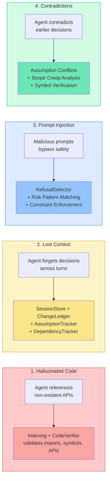
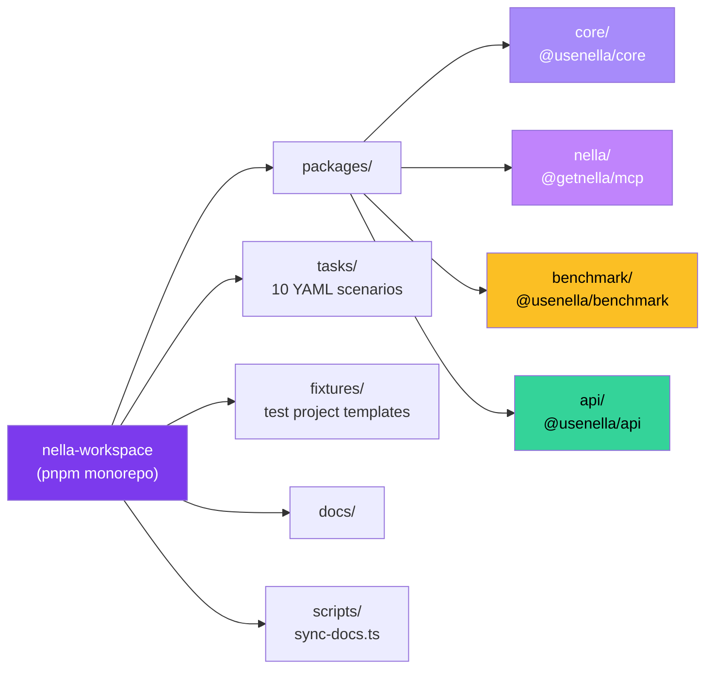
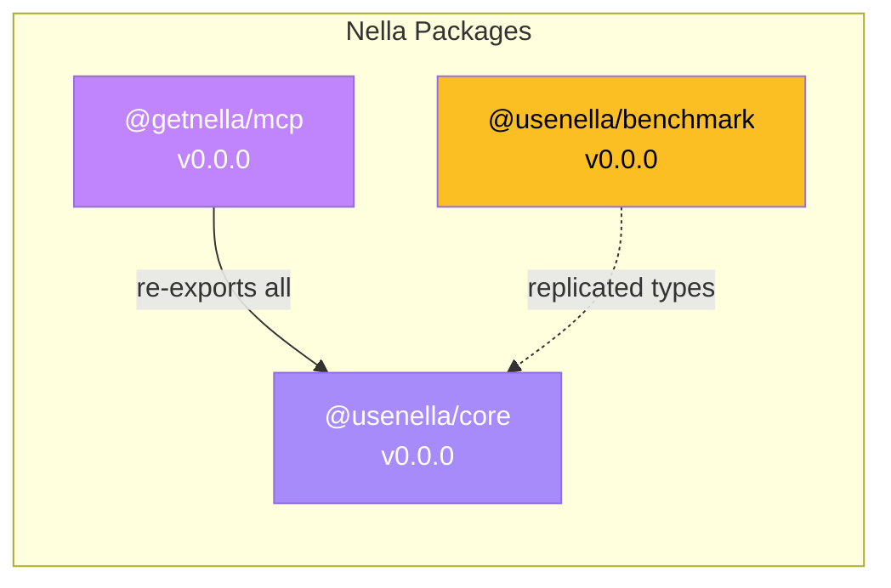

# Architecture Overview

Nella is a reliability layer for AI coding agents, structured as a TypeScript monorepo with four packages that work together to validate, guard, and track agent-generated code changes.

## System Topology

```mermaid
graph TB
    Agent["AI Coding Agent<br/>(Claude, Copilot, Cursor, Cline)"]

    subgraph nella_pkg["@getnella/mcp v0.0.0"]
        CLI["CLI<br/>nella check | validate | run | mcp | serve | connect | auth | playground"]
        MCP["MCP Server<br/>(stdio transport)"]
        HostedMCP["Hosted MCP Server<br/>(Streamable HTTP)"]
        AuthCLI["Auth CLI<br/>login | logout | status"]
    end

    subgraph core_pkg["@usenella/core v0.0.0"]
        RunEngine["Run Engine<br/>runTask() | check() | validate()"]
        Validators["Validators"]
        Safety["Safety"]
        Indexing["Indexing / RAG"]
        Context["Context Management"]
        Workspace["Workspace Management"]
        Auth["Auth & Rate Limiting"]
        Sync["Cloud Sync"]
        ContextSharing["Context Sharing"]
        Playground["Playground Server"]
        Agents["Agent Runner"]
        RateLimit["Rate Limiting"]
        GCP["GCP Backend"]
        Supabase["Supabase Backend"]
    end

    subgraph benchmark_pkg["@usenella/benchmark v0.0.0"]
        BenchRunner["Benchmark Runner"]
        Adapters["Agent Adapters<br/>(Anthropic, OpenAI)"]
        Metrics["Metrics Calculator"]
        Reports["Report Generators"]
    end

    subgraph external["External Services"]
        Supabase["Supabase<br/>(PostgreSQL + pgvector)"]
        GCP["Google Cloud<br/>(Cloud SQL + Storage)"]
        EmbeddingAPIs["Embedding APIs<br/>(Voyage, OpenAI)"]
        Cohere["Cohere<br/>(Reranking)"]
        LLMAPIs["LLM APIs<br/>(Anthropic, OpenAI)"]
    end

    Agent -->|"stdio (MCP protocol)"| MCP
    Agent -->|"direct"| CLI
    MCP --> RunEngine
    CLI --> RunEngine
    RunEngine --> Validators
    RunEngine --> Safety
    RunEngine --> Context
    Indexing --> EmbeddingAPIs
    Indexing --> Cohere
    Sync --> Supabase
    Sync --> GCP
    BenchRunner --> Adapters
    Adapters --> LLMAPIs

    style Agent fill:#6366f1,color:#fff
    style nella_pkg fill:#f3e8ff,stroke:#7c3aed
    style core_pkg fill:#ede9fe,stroke:#6d28d9
    style benchmark_pkg fill:#fef3c7,stroke:#d97706
    style external fill:#ecfdf5,stroke:#059669
```

## Four Core Problems

Nella addresses four fundamental problems with AI-assisted development:

| Problem | Module | How It Works |
|---------|--------|--------------|
| **Hallucinated Code** | Indexing + CodeVerifier | Indexes your codebase, then verifies AI-generated imports, symbols, and API calls against real exports |
| **Lost Context** | ContextManager | Persists sessions, change history, assumptions, and dependency snapshots across agent turns |
| **Prompt Injection** | Safety / RefusalDetector | 26 regex-based risk patterns detect credential exposure, destructive operations, security bypasses, and backdoors |
| **Contradictions** | AssumptionTracker + ScopeChecker | Detects when planned changes conflict with prior assumptions; measures scope creep ratio |

## Monorepo Structure

| Package | Description | Key Exports |
|---------|-------------|-------------|
| `@usenella/core` | Core engine — validators, safety, indexing, context, workspace, auth, sync | `runTask()`, `check()`, `validate()`, `shouldRefuse()`, `ContextManager`, `IndexManager` |
| `@getnella/mcp` | CLI + MCP server. Re-exports all of core | `startMcpServer()`, CLI commands, MCP tool handlers |
| `@usenella/benchmark` | Benchmark runner for evaluating agent performance | `BenchmarkRunner`, agent adapters, metrics calculator |
| `@usenella/api` | REST API server (Express) for hosted deployments | Health, workspace, search, validate, context, auth endpoints |

## Package Dependencies

`@getnella/mcp` depends on and re-exports everything from `@usenella/core`, adding the CLI interface and MCP server on top. `@usenella/benchmark` replicates core types but does not directly depend on the core package at runtime.

## Related Architecture Pages

- [Core Modules](./core-modules.md) — Deep dive into the run engine, validators, context, and workspace modules
- [MCP Server](./mcp-server.md) — MCP protocol implementation, tool routing, and hosted server
- [Indexing & RAG](./indexing-rag.md) — Code chunking, embedding, hybrid search, and code verification
- [Security & Auth](./security-auth.md) — Safety detection, authentication, rate limiting, and cloud sync
