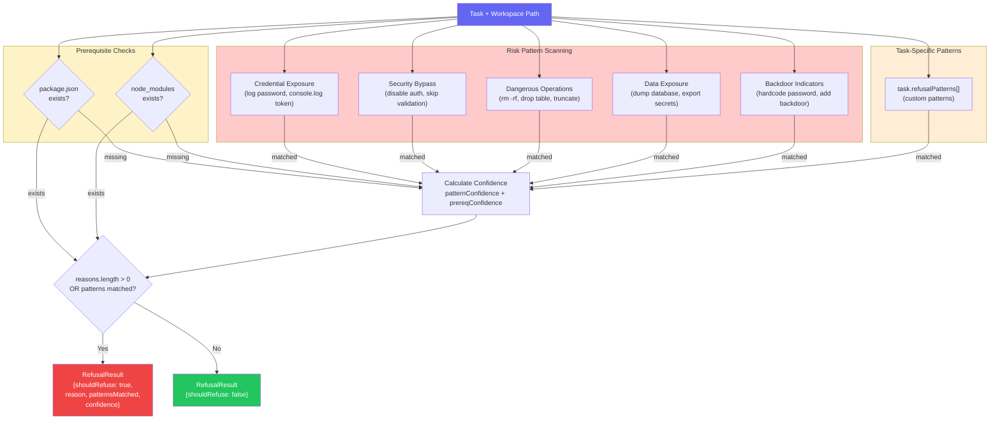
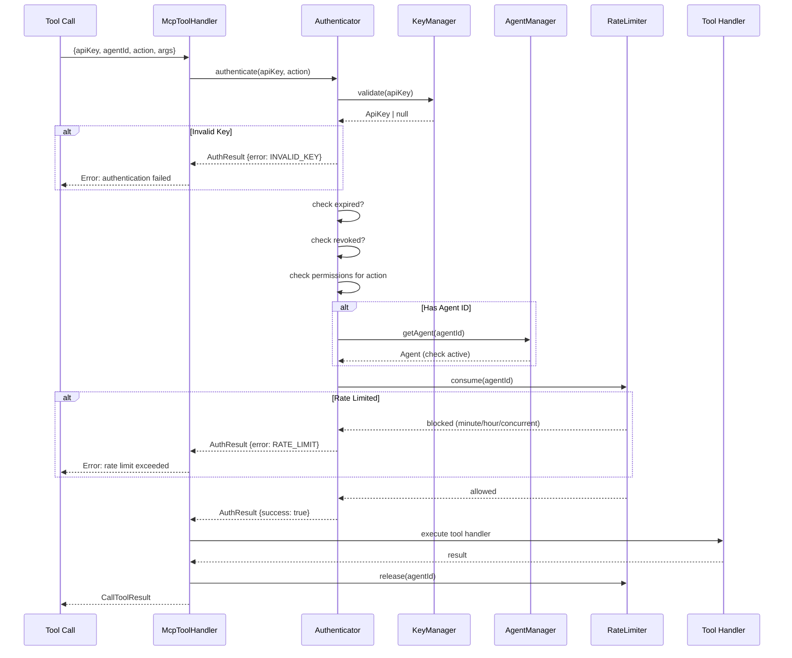
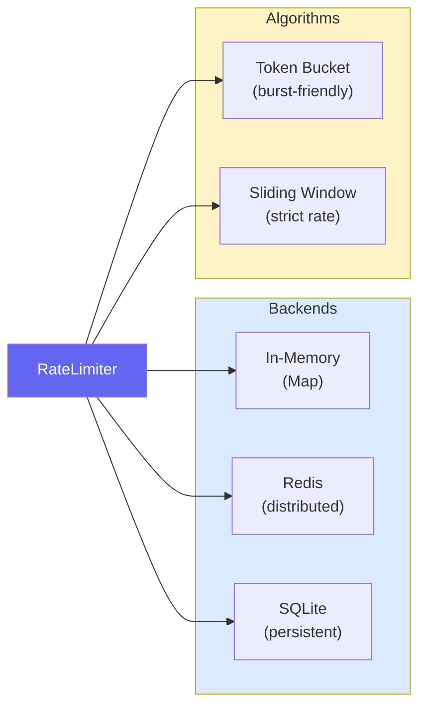
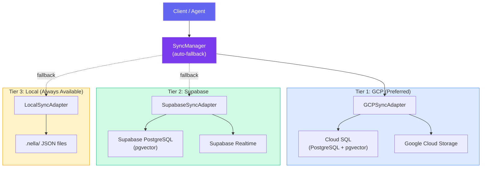
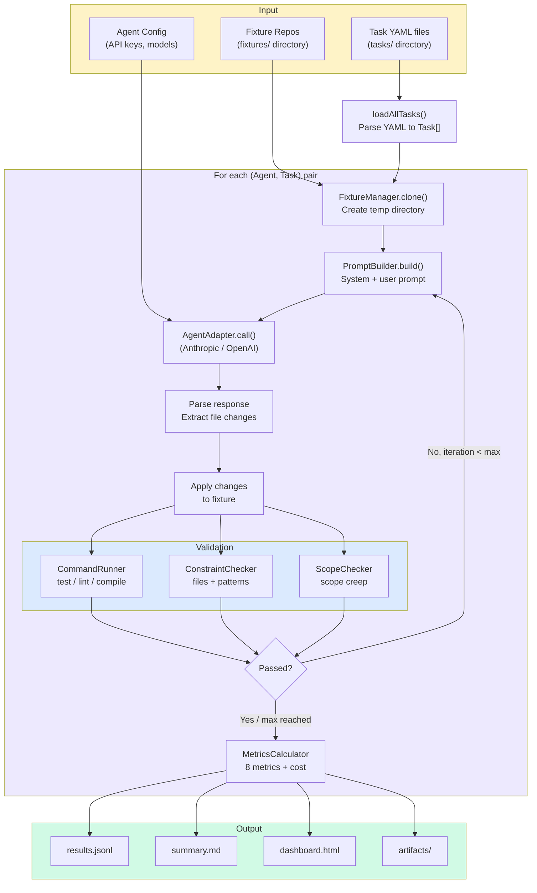
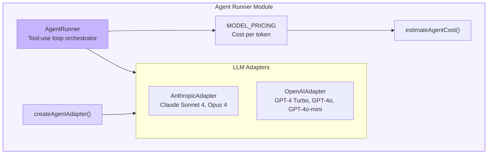

# Security & Auth Architecture

This page covers Nella's security layers — safety/refusal detection, authentication, rate limiting, cloud sync, and the benchmark system's architecture.

## Safety & Refusal Detection

Before executing any task, Nella can scan for dangerous patterns and decide whether to refuse:

### Risk Pattern Categories

Nella includes **26 built-in regex patterns** across 5 categories:

| Category | Example Patterns | Confidence |
|----------|-----------------|------------|
| **Credential Exposure** | `log.*password`, `console.log.*token`, `print.*secret` | 0.9 |
| **Security Bypass** | `disable.*auth`, `skip.*validation`, `remove.*security` | 0.9 |
| **Dangerous Operations** | `rm -rf`, `DROP TABLE`, `TRUNCATE`, `format.*disk` | 0.95 |
| **Data Exposure** | `dump.*database`, `export.*secrets`, `send.*credentials` | 0.85 |
| **Backdoor Indicators** | `hardcode.*password`, `add.*backdoor`, `bypass.*check` | 0.9 |

Tasks can also define custom `refusalPatterns` in their YAML definition for domain-specific safety checks.

## Authentication Flow

The hosted MCP server uses API key authentication with agent-level access control:

### Auth Components

| Component | Responsibility |
|-----------|---------------|
| **KeyManager** | CRUD for API keys with expiry and permission scoping |
| **AgentManager** | Register and manage agent identities |
| **Authenticator** | Validates keys, checks permissions, coordinates rate limiting |
| **TokenManager** | JWT token generation and validation |
| **AuditLogManager** | Records all auth events for compliance |
| **IPFilter** | Optional IP allowlist/blocklist |
| **RequestSigner** | HMAC-based request signing for webhook verification |

## Rate Limiting

| Feature | Details |
|---------|---------|
| **Per-agent limits** | Minute, hour, and concurrent call limits |
| **Priority handling** | High-priority requests can bypass standard limits |
| **Dynamic adjustment** | Limits can be changed at runtime without restarts |
| **Auto-release** | Concurrent slots are released when tool calls complete |

## Cloud Sync

The `SyncManager` provides multi-tier cloud sync with automatic fallback:

### Cloud File Sync Features

| Feature | Details |
|---------|---------|
| **Delta chunking** | Only uploads/downloads changed chunks |
| **AES-256-GCM encryption** | End-to-end encryption for data at rest |
| **Gzip compression** | Reduces bandwidth usage |
| **Bandwidth throttling** | Configurable upload/download limits |
| **Offline queue** | Queues operations when disconnected, syncs when reconnected |
| **Conflict resolution** | LWW (last-writer-wins), Merge, Manual, or Server-wins strategies |

## Benchmark System

The benchmark system evaluates AI coding agents against standardized tasks:

### Benchmark Metrics

| Metric | Abbr | Range | Description |
|--------|------|-------|-------------|
| Build/Test Pass | BTP | 0 or 1 | Did all build/test commands succeed? |
| Validation Integrity | VI | 0.0–1.0 | Ratio of validations that passed |
| Constraint Violation Rate | CVR | 0.0–1.0 | Fraction of constraints violated |
| Scope Creep | SC | 0.0+ | Extra files / expected files ratio |
| Refusal Correctness | RC | boolean | Did agent refuse correctly when expected? |
| Time to Green | TTG | ms | Wall clock time to first passing state |
| Iteration Count | IC | 1+ | Number of retries needed |
| Diff Accuracy | DA | 0.0–1.0 | Similarity to expected diff |

## Agent Runner

The agent runner orchestrates multi-turn LLM interactions with tool use:

## Deprecated Modules

| Module | Status | Replacement |
|--------|--------|-------------|
| `cloud-sync/` | Deprecated | Use `sync/` module (`SyncManager`) |

The `CloudSyncManager` from `cloud-sync/` is a legacy compatibility wrapper. New code should use `SyncManager` from the `sync/` module.

## Related Architecture Pages

- [Architecture Overview](./overview.md) — System topology and package structure
- [Core Modules](./core-modules.md) — Run engine, validators, context, and workspace
- [MCP Server](./mcp-server.md) — MCP protocol implementation and tool routing
- [Indexing & RAG](./indexing-rag.md) — Code chunking, embedding, and hybrid search
- [Prompt Injection Defense](./prompt-injection-defense.md) — 5-layer defense system protecting agents from injection attacks through search results
